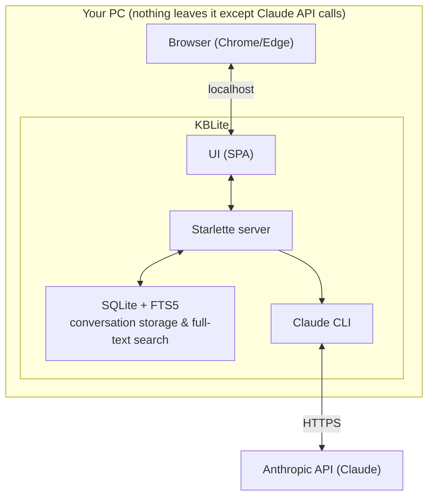
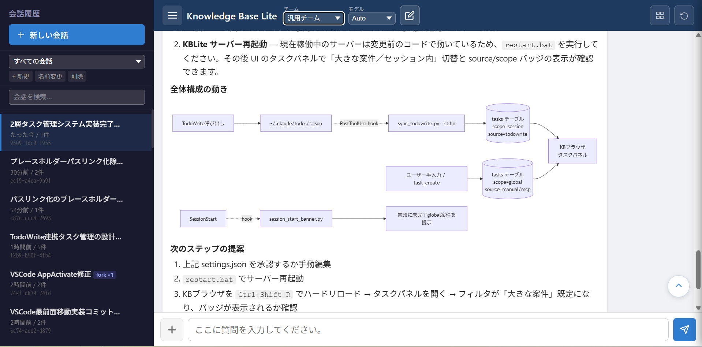

# KBLite — Never lose a Claude Code conversation.

> All conversations stay on your machine. No external transmission.

[日本語版 README はこちら](README.md)

**Requirements:** Windows only. A Claude Pro (or higher) subscription and a working Claude Code installation are required. Use at your own risk.

---

## What is this?

KBLite is a **lightweight browser UI for Claude Code** that automatically **records and remembers every conversation** on your local machine.

The official terminal (and web) clients lose your context the moment a session ends. KBLite keeps everything in a local SQLite database, so you can:

- **Resume** any past conversation by its history ID, with full context restored
- **Branch (fork)** a conversation to explore a different direction without losing the original
- **Search** every conversation you have ever had, full-text (SQLite FTS5)

No terminal required. No cloud storage. No account other than your existing Claude subscription.

## Who is it for?

- You use Claude Code but find the **terminal hard to read**
- You keep asking *"where did that conversation go?"*
- You want answers rendered **with tables, diagrams, and code blocks**
- You want your conversation data to stay **on your own PC, and nowhere else**

---

## Architecture

**Point:** All conversation data is stored in a local SQLite database. The only thing that goes to the cloud is your prompt and Claude's response — exactly as with plain Claude Code.

---

## Features

| Feature | Description |
|---|---|
| Conversation memory | Every conversation is auto-saved to SQLite. Close the app, nothing is lost |
| Resume by history ID | Recall any past session and continue right where you left off |
| Conversation branching | Fork the current context into a new thread without destroying the original |
| Full-text search | Search all conversations instantly (FTS5) |
| Markdown rendering | Tables, code blocks, and lists rendered cleanly |
| Mermaid rendering | Flowcharts, ER diagrams, and sequence diagrams drawn automatically |
| File operations | Read and write local files directly |
| Model switching | Choose Auto / Haiku 4.5 / Sonnet 4.6 / Opus 4.6 / Opus 4.7 per question |
| Team mode | Switch between a general-purpose agent team and an IT-specialist team |
| Export | Copy as Markdown, download as `.md`, or print |
| CLAUDE.md customization | Persist per-project instructions for the AI |

---

## Screenshots & Demo

**Main screen (click for a demo video):**

---

## Installation

1. Download `KBLite_Setup.exe` from [Releases](https://github.com/76Hata/KBLite/releases)
2. Run the installer — no Git, Docker, or WSL required
3. Open your browser and start talking to Claude

> **Prerequisite:** Claude Code must be installed and authenticated on your machine beforehand.

---

## Design philosophy: why so light?

KBLite deliberately dropped heavy dependencies (ChromaDB, Docker, RAG pipelines) that its predecessor carried. Conversation storage, management, and search are handled by **SQLite + FTS5 alone** — good enough, fast, and zero-maintenance for a personal knowledge base.

- Python (Starlette) backend, single-page HTML/JS frontend
- No background services, no containers
- Your data is one portable `.db` file

---

## Privacy

- All conversations are stored **only** on your PC
- KBLite itself sends **nothing** anywhere; only the Claude CLI talks to the Anthropic API
- Uninstalling removes everything

## License

[MIT](LICENSE)

## Author

[@76Hata](https://github.com/76Hata) — a Japanese systems engineer building AI tooling in public.
Feedback and issues are welcome, in English or Japanese.
