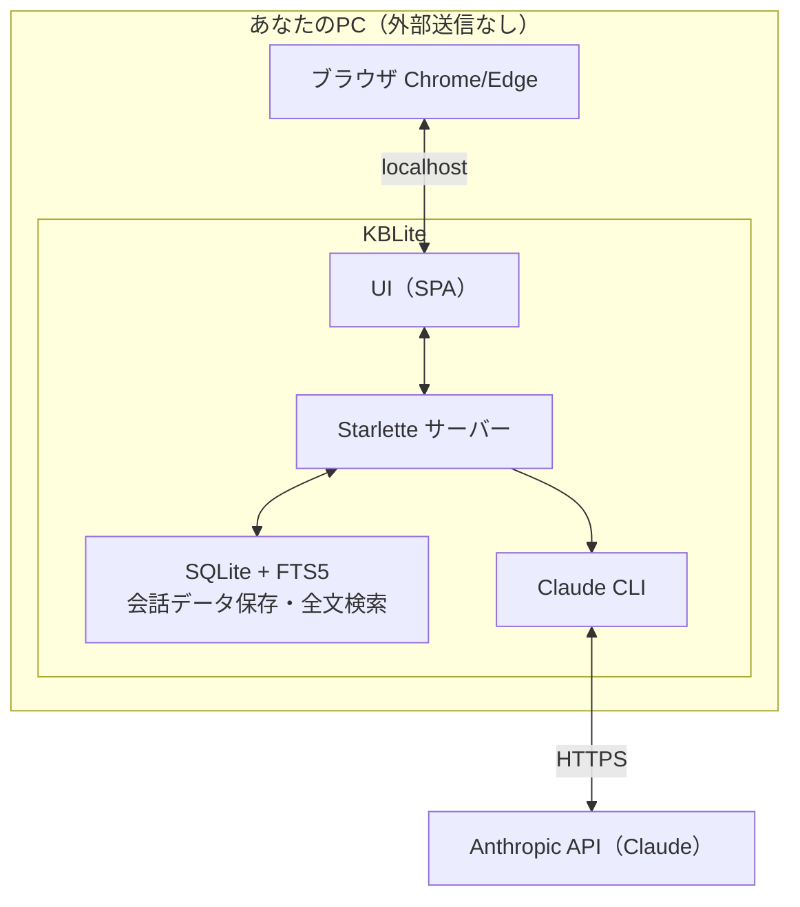
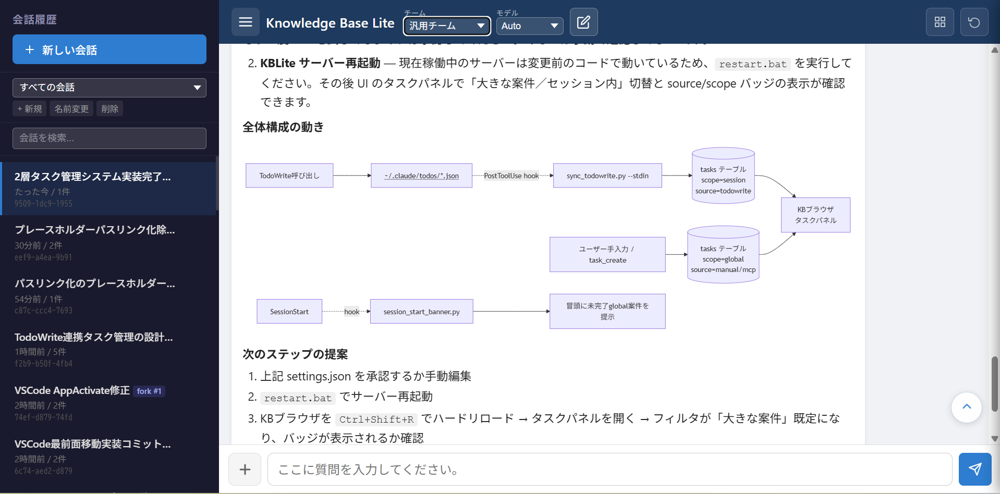
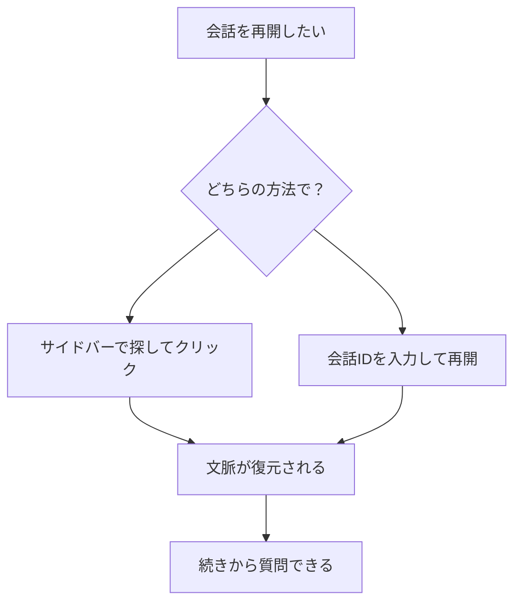
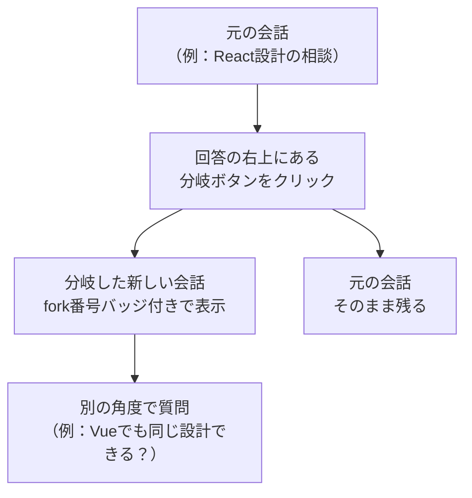

※ 利用にはClaude Pro以上の加入が必要です。

※ こちらはWindows専用です。

※ 利用は自己責任でお願いします。本アプリを利用して生じたいかなる損害も当方は一切関知致しません。

# KBLite — Claude Codeを、ブラウザで。

> All conversations stay on your machine. No external transmission.
> KBlite内でのすべての会話はあなたのPC内に保存されます。外部への送信は一切ありません。

---

## これは何？

KBLiteは **Claude Codeの出力をブラウザで表示する軽量UIツール** です。

ターミナル（黒い画面）を使わずに、ブラウザ上でClaude Codeと対話できます。
しかも **会話を自動で記録・記憶する機能** を内蔵しているため、ChatGPTのように「毎回ゼロから説明し直す」必要がありません。

## 誰のためのツール？

- Claude Codeを使い始めたけど、**ターミナルが読みにくい**と感じている人
- 会話の**履歴管理**に困っている人（あの話どこ行った？）
- Claudeの回答を**表・図・コード付きで見やすく**表示したい人
- データは**自分のPCだけ**に置きたい人

> **前提:** Claude Code のインストール・APIキーの取得が済んでいること。

---

## 全体構成



**ポイント:** 会話データはすべてローカルのSQLiteに保存。クラウドに出るのはClaudeへの質問・回答のみです。

---

## 機能一覧

| 機能 | 説明 |
|---|---|
| 会話記憶 | 全会話をSQLiteに自動保存。閉じても消えない |
| 会話履歴ID再開 | 過去の会話をIDで呼び出し、その続きができる |
| 会話分岐 | 現在の文脈を引き継いだまま、別の話題に分岐できる |
| 全文検索 | FTS5で全会話をキーワード検索 |
| Markdown描画 | 表・コードブロック・箇条書きを整形表示 |
| Mermaid描画 | フローチャート・ER図・シーケンス図を自動描画 |
| ファイル操作 | PC内ファイルを直接読み書き |
| モデル切り替え | Auto / Haiku 4.5 / Sonnet 4.6 / Opus 4.6 / Opus 4.7 を質問ごとに選択 |
| チームモード | 汎用チーム / IT専門家チーム を用途に応じて切り替え |
| 回答エクスポート | コピー（Markdown）・ダウンロード（.md）・印刷 |
| CLAUDE.md カスタマイズ | AIの振る舞いをプロジェクトごとに恒久設定 |

---

## 画面の見方

KBLiteの画面は **3つのエリア** で構成されています。

**実際の画面:**



<iframe width="560" height="315"
  src="https://www.youtube.com/embed/LdM5UYxeBDs"
  frameborder="0" allowfullscreen>
</iframe>

### ① ヘッダー（画面上部）

| 部品 | 機能 | 備考 |
|---|---|---|
| **KBLite（タイトル）** | ホームに戻る | クリックで会話一覧にリセット |
| **チームモード** | 応答するエージェントを切り替える | **汎用チーム**（日常作業）/ **IT専門家チーム**（コード・技術作業）|
| **Auto ▼** | 自動モードの ON/OFF | ONで質問内容に応じたモデルを自動選択 |
| **モデル選択 ▼** | Claudeのモデルを手動で選ぶ | Auto / Haiku 4.5 / Sonnet 4.6 / Opus 4.6 / Opus 4.7 |
| **＋ 新しい会話** | 文脈を完全リセットして新規スタート | サイドバーの「新しい会話」と同じ |

> **Autoとは？** 「400文字超」「設計・セキュリティ等のキーワード」「添付ファイルあり」を検知するとOpusを自動選択。普段はAutoのままで問題ありません。

---

### ② 左サイドバー（画面左側）

| 部品 | 機能 |
|---|---|
| **🔍 検索窓** | キーワードで過去の全会話を全文検索（FTS5）|
| **会話履歴一覧** | 過去のセッション一覧。クリックすると文脈が復元されて再開できる |
| **↳ fork #1 バッジ** | 分岐した会話。親会話と区別しやすいよう背景色が異なる |

---

### ③ メインエリア（画面右側・中央）

| 部品 | 機能 |
|---|---|
| **回答表示エリア** | Claudeの回答。Markdown・Mermaid図・コードブロックを整形表示 |
| **📋 コピーボタン** | 回答をMarkdown形式でクリップボードにコピー |
| **⬇ DLボタン** | 回答を `.md` ファイルとして保存 |
| **⎇ 分岐ボタン** | この時点の文脈を引き継いで新しい会話を分岐（fork）|
| **入力欄** | 質問・指示を入力。Shift+Enterで改行、Enterで送信 |

---

## ChatGPTと何が違うの？

| | ChatGPT | KBLite |
|---|---|---|
| 会話の記憶 | 会話ごとにリセット（メモリ機能は限定的） | **全会話を自動保存。キーワードで検索可能** |
| データの保存先 | OpenAIのサーバー | **あなたのPC内のみ** |
| ファイル操作 | アップロードしたファイルのみ | **PC内のファイルを直接読み書き** |
| コード実行 | サンドボックス内のみ | **あなたのPC上でそのまま実行** |
| 図の描画 | 画像生成のみ | **Mermaidで編集可能なフローチャート・図を自動描画** |
| 出力の活用 | コピー＆ペースト | **ワンクリックでコピー・ダウンロード・印刷** |
| カスタマイズ | プロンプト程度 | **CLAUDE.mdでAIの振る舞いを恒久的に設定** |

---

## KBLiteでできること

### 1. 会話を記憶する

KBLiteは過去の会話をすべてSQLiteデータベースに保存します。「先週話したあれ」を探せます。

**サンプルプロンプト:**
```
前回のミーティングメモの内容を踏まえて、今日のアジェンダを作って
```
```
先月の売上分析で使ったグラフ、もう一度出して
```
```
「React」について話した会話を全部探して
```

> **ポイント:** ChatGPTでは会話を閉じると文脈が消えますが、KBLiteでは過去の会話が検索・参照可能です。

---

### 2. 過去の会話を履歴IDで再開する

左サイドバーに会話履歴が一覧表示されます。クリックするだけで、その会話の **続き** ができます。



**方法1: サイドバーからクリック**
1. 左サイドバーから再開したい会話を探す
2. タイトルをクリック
3. 過去の文脈が復元された状態で入力欄が使えるようになる

**方法2: 会話IDを使って再開**

各セッション一覧には **12文字の会話ID**（例: `78b1b786-6f2b`）が表示されています。  
以下のフォーマットで入力することで、どこからでもその会話に直接ジャンプできます。

```
会話履歴ID（78b1b786-6f2b）の続きです。

さっきの議事録の修正版を作って
```

> **ポイント:** 長い作業を複数日に分けて続けられます。会話IDをメモしておけば、後からピンポイントで再開できます。

---

### 3. 会話を分岐させる

現在の会話の **文脈を引き継いだまま** 別の話題に分岐できます。元の会話には影響しません。



**分岐ボタンの場所:**  
各回答の **右上アクションバー** にあるフォークアイコン（⎇ 新しい会話に分岐）をクリックします。

| 操作 | 動作 | 使いどころ |
|---|---|---|
| **分岐（fork）** | 今の文脈を引き継ぎ、新しい会話を開始 | 「同じ前提で別の方向を試したい」 |
| **新しい会話** | 文脈を完全リセット | 「まったく別のテーマを始めたい」 |

> **ポイント:** 分岐した会話はサイドバーに「fork #1」バッジ付きで表示されるため、元の会話と区別できます。元の会話を壊さずに試行錯誤できます。

---

### 4. ファイルを直接操作する

デスクトップのファイルを読み込んで分析したり、新しいファイルを作成して保存できます。

**サンプルプロンプト:**
```
デスクトップにある「売上データ.csv」を読み込んで、月別の推移をまとめて
```
```
以下の内容で議事録を作成して、Wordファイルとしてデスクトップに保存して

日時: 2026年4月19日 14:00
参加者: 田中、佐藤、鈴木
議題: Q2の販売戦略について
```
```
Downloadsフォルダにある請求書PDFの内容を読み取って、Excelの一覧表にまとめて
```

> **ポイント:** ファイルをアップロードする手間がありません。パスを伝えるだけで直接アクセスします。

---

### 5. 表・図・コードを美しく表示する

Markdown記法で表やリストを整形表示。Mermaidでフローチャート・図を自動描画します。

**サンプルプロンプト:**
```
AWS、Azure、GCPの主要サービスを比較表にして
```
```
新規顧客の問い合わせから契約までのフローチャートを描いて
```
```
このPythonコードにバグがないかチェックして、修正版を出して

def calc_tax(price):
    return price * 1.1
```

> **ポイント:** 図はMermaid形式で生成されるため、後から編集も可能。表はそのままコピーしてExcelに貼り付けられます。

---

### 6. コードを書いて実行する

Pythonスクリプトの作成・実行、バッチ処理、データ変換など、プログラミングタスクを任せられます。

**サンプルプロンプト:**
```
毎週月曜に「週報テンプレート.docx」を自動作成するPythonスクリプトを作って
```
```
このフォルダ内のJPEG画像を全部リサイズして、横幅800pxに統一して
```
```
Excelファイルの「Sheet1」と「Sheet2」を結合して、重複を除いた一覧を作って
```

> **ポイント:** 「プログラミングできなくても大丈夫」。やりたいことを日本語で伝えれば、コードの作成から実行まで全部やってくれます。

---

### 7. AIの振る舞いをカスタマイズする

プロジェクトフォルダに `CLAUDE.md` というファイルを置くと、AIの応答スタイルや知識を恒久的にカスタマイズできます。

**サンプルプロンプト:**
```
このプロジェクト用のCLAUDE.mdを作って。以下のルールを入れて：
- 回答は日本語で
- コードはTypeScriptで書く
- テストは必ずJestで書く
```

**CLAUDE.mdの例:**
```markdown
# プロジェクトルール
- 回答はすべて日本語
- 専門用語には必ず簡単な説明を添える
- 提案時は必ずメリット・デメリットを併記する
```

> **ポイント:** フォルダを切り替えるだけでAIの専門性が変わります。「営業用フォルダ」「開発用フォルダ」で別々の設定を持てます。

---

### 8. 過去の会話を全文検索する

左サイドバーの検索窓から、過去のすべての会話をキーワード検索できます。

**使い方:**
1. 左サイドバーの検索窓にキーワードを入力
2. 該当する会話の一覧が表示される
3. クリックすると会話全体を閲覧・再開可能

```
検索例: 「予算」「見積もり」「React hooks」「エラー対応」
```

> **ポイント:** 全文検索（FTS5）を使っているので、会話の中に含まれるどんなキーワードでもヒットします。

---

### 9. 回答をすぐ活用する

すべての回答にコピー・ダウンロード・印刷ボタンが付いています。

| ボタン | 機能 | 用途の例 |
|---|---|---|
| コピー | Markdown形式でクリップボードへ | Slackやメールに貼り付け |
| ダウンロード | .mdファイルとして保存 | 報告書の素材として保管 |
| 印刷 | ブラウザの印刷機能で出力 | 紙の資料として配布 |

---

### 10. モデルを切り替える

ヘッダーのドロップダウンから、用途に応じてClaudeのモデルを切り替えられます。

| モデル | 特徴 | おすすめ用途 |
|---|---|---|
| **Auto** | 内容を自動判定して最適モデルを選択 | 迷ったらこれ（デフォルト推奨） |
| **Haiku 4.5** | 高速・低コスト | 簡単な質問、翻訳、軽い作業 |
| **Sonnet 4.6** | バランス型 | 日常的な作業全般 |
| **Opus 4.6** | 高精度 | 複雑な分析、重要な文書作成 |
| **Opus 4.7** | 最高精度 | 最重要タスク、コードレビュー |

> **ポイント:** Autoは「400文字超の質問」「設計・セキュリティ等のキーワード」「添付ファイルあり」を検知するとOpusを自動選択します。普段はAutoのままで問題ありません。

---

## 使いこなしのヒント

### やりたいことを「具体的に」伝える

```
❌ 「資料を作って」
⭕ 「先月の売上データ（Desktop/sales_march.csv）を月別・商品別にクロス集計して、
    上位5商品の推移グラフ付きのレポートをMarkdownで作って」
```

### 「続き」を活用する

KBLiteは会話の文脈を保持しています。長い作業は一度に頼まず、段階的に進めましょう。

```
1回目: 「この要件定義書を読んで、問題点をリストアップして」
2回目: 「その中で優先度が高い3つについて、改善案を出して」
3回目: 「改善案をまとめて、クライアント向けの報告書にして」
```

### ファイルパスは正確に

ファイル操作を依頼するときは、正確なパスを伝えましょう。

```
❌ 「あのExcelファイルを開いて」
⭕ 「C:\Users\taro\Desktop\budget_2026.xlsx を開いて」
```

### CLAUDE.mdを育てる

繰り返し同じ指示を出していることに気づいたら、それをCLAUDE.mdに書きましょう。

```
毎回「日本語で答えて」と言っている → CLAUDE.mdに「回答は日本語」と書く
毎回「コードにコメントを入れて」と言っている → CLAUDE.mdに「コードには日本語コメントを付ける」と書く
```

---


## よくある質問

**Q: インターネット接続は必要ですか？**
A: Claude Code APIとの通信にインターネット接続が必要です。ただし、過去の会話の閲覧・検索はオフラインでも可能です。

**Q: 会話データはどこに保存されますか？**
A: インストールフォルダ内のSQLiteデータベースに保存されます。クラウドへの送信は一切行いません。バックアップはフォルダごとコピーするだけです。

**Q: Claude CodeのAPIキーは必要ですか？**
A: はい。Anthropicのアカウントを作成し、APIキーを取得してください。KBLiteはClaude Codeを内部で利用しているため、Claude Codeのセットアップが前提です。

**Q: ChatGPTやGeminiでも使えますか？**
A: いいえ。KBLiteはClaude Code専用です。他のAIサービスには対応していません。

**Q: 複数のプロジェクトを切り替えられますか？**
A: はい。作業フォルダ（ワークスペース）を切り替えることで、プロジェクトごとに独立した会話履歴とCLAUDE.md設定を持てます。

---

## セットアップ

### 必要なもの

- Windows 10以降
- Claude Codeがインストール済みであること
- Anthropic APIキー

### インストール

`installer/dist/KBLite_Setup.exe` を実行します。

1. ウィザードの指示に従いインストール先フォルダを選択する（デフォルト: `C:\KBLite`）
2. インストール完了後、初回起動時にAPIキーを設定する
3. ブラウザが自動で開く → すぐ使い始められます

> Git、Docker、WSLは一切不要です。

インストーラーは以下を自動でセットアップします。

| 内容 | 詳細 |
|---|---|
| KBLite本体 | 指定フォルダに一式を展開 |
| スタートメニュー | 「KBLite」ショートカットを登録 |
| レジストリ | アンインストール情報を `HKCU\Software\KBLite` に書き込み |
| 自動起動（任意） | スタートアップ登録の選択が可能 |

---

### アンインストール

`installer/dist/KBLite_Uninstall.exe` を実行するか、Windowsの「アプリと機能」からKBLiteを選択して削除します。

アンインストールウィザードが起動し、以下を自動でクリーンアップします。

| 削除対象 | 詳細 |
|---|---|
| KBLite本体 | インストールフォルダ内のファイルを全削除 |
| スタートメニュー | ショートカットを削除 |
| レジストリ | `HKCU\Software\KBLite` エントリを削除 |

> **会話データについて:** インストールフォルダ内の `kblite.db`（会話履歴）は削除されません。データを残したい場合はそのままにしてください。完全に消去する場合はフォルダごと手動で削除してください。

---

## ライセンス

MIT License

---

*KBLite は個人開発のオープンソースツールです。*

---

※ 利用にはClaude Pro以上の加入が必要です。
※ こちらはWindows専用です。
※ 利用は自己責任でお願いします。本アプリを利用して生じたいかなる損害も当方は一切関知致しません。
