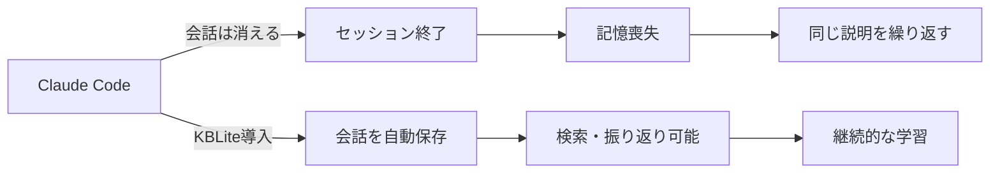
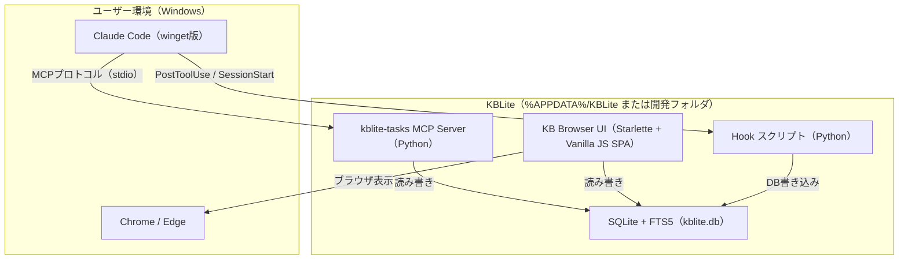
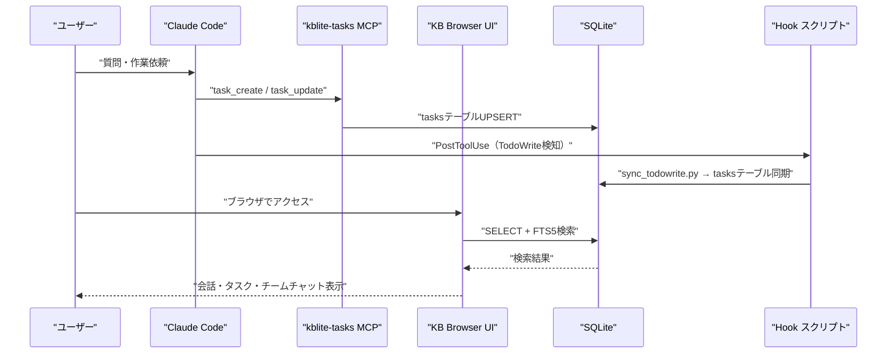
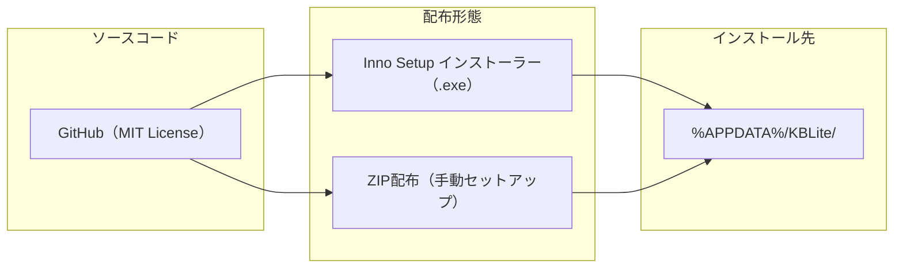

# KBLite 概要設計書

| 項目 | 内容 |
|------|------|
| 文書ID | DESIGN-001 |
| 作成日 | 2026-04-14 |
| 最終更新 | 2026-04-23 |
| バージョン | 2.0 |
| ステータス | 更新中（実装反映済み） |

---

## 1. プロジェクト概要

### 1.1 プロダクト名
**KBLite** — Claude Code用 軽量ナレッジブラウザ

### 1.2 目的

| 目標 | 詳細 |
|------|------|
| 主目標 | Claude Codeの会話履歴を永続化し、ブラウザで閲覧・検索可能にする |
| 副目標1 | チームチャット機能でAIエージェントをチーム編成して使えるようにする |
| 副目標2 | タスク管理・プロジェクト管理でClaudeの作業を整理・追跡する |
| 副目標3 | OSS公開を通じた認知拡大・AI関連の仕事獲得 |
| 非目標 | RAGベクター検索、外部クローラー、マルチユーザー対応 |

### 1.3 背景

Claude Codeはセッション終了時に会話履歴が消失する。
KBLiteは会話内容をSQLiteに永続化し、ブラウザUIで検索・閲覧・チームチャット・タスク管理などを行える総合ツールとして拡張された。

### 1.4 ターゲットユーザー
- Claude Code初心者（プログラミング経験が浅い層を含む）
- WSL/Docker未導入のWindows環境ユーザー
- 会話履歴を残したい・振り返りたいユーザー
- AIエージェントをチーム編成して使いたいユーザー

---

## 2. システム全体構成

### 2.1 コンポーネント一覧

| # | コンポーネント | 技術 | 役割 |
|---|--------------|------|------|
| 1 | kblite-tasks MCP Server | Python + mcp SDK | タスク管理6ツールをClaude Codeに提供 |
| 2 | KB Browser UI | Starlette + Vanilla JS SPA | 会話閲覧・検索・チームチャット・タスク・プロジェクト管理 |
| 3 | SQLite + FTS5 | sqlite3（Python標準） | データ永続化 + 全文検索 |
| 4 | Hook スクリプト群 | Python | TodoWrite同期・権限申請・セッション開始バナー・ステータスライン |
| 5 | Inno Setup Installer | Inno Setup 6 / PyInstaller | Windows向けインストーラー |
| 6 | installer/source/ ミラー | Python | インストール先への配布用ソースコピー |

### 2.2 コンポーネント間の連携

---

## 3. 機能一覧

### 3.1 kblite-tasks MCPツール（6本）

| # | ツール名 | 機能 | 呼び出し元 |
|---|----------|------|-----------|
| 1 | `task_create` | タスクを作成（scope=global/session、source=mcp） | Claude Code |
| 2 | `task_list` | タスク一覧取得（status/scope/sourceフィルタ） | Claude Code |
| 3 | `task_update` | タスク更新（status/priority/title/description） | Claude Code |
| 4 | `task_delete` | タスク削除 | Claude Code |
| 5 | `task_add_note` | タスクへメモ追加 | Claude Code |
| 6 | `task_resume_context` | 未完了タスク一覧（再開時コンテキスト復元） | Claude Code |

### 3.2 Browser UI機能

| # | 機能 | 説明 |
|---|------|------|
| 1 | 会話履歴閲覧 | セッション別に会話を時系列表示。Markdown/Mermaid/draw.io描画対応 |
| 2 | 全文検索 | FTS5によるキーワード検索（会話・Q&A対象） |
| 3 | チームチャット | AIエージェントをチーム編成してSSEストリームで回答生成 |
| 4 | タスク管理パネル | KBLiteタスクの一覧・追加・更新（右パネル）。TodoWrite自動同期 |
| 5 | プロジェクト管理 | セッションをプロジェクト単位に分類・管理 |
| 6 | 認証管理 | APIキー設定・Claude CLIログイン（OAuth）のUI |
| 7 | 権限管理 | allowリスト管理・権限申請のレビュー（承認/拒否） |
| 8 | 設定管理 | app-config.jsonのモデル・エージェント・チーム設定 |
| 9 | プロジェクト自動構築 | CLAUDE.md/settings.local.json/memoryフォルダを自動生成（scaffold機能） |

### 3.3 Hook スクリプト（Python 4本）

| # | ファイル | イベント | 機能 |
|---|---------|---------|------|
| 1 | `sync_todowrite.py` | PostToolUse | TodoWrite書き込みを検知しtasksテーブルにUPSERT |
| 2 | `perm_request_hook.py` | PostToolUse | ツールブロック時に権限申請APIへ自動投稿 |
| 3 | `session_start_banner.py` | SessionStart | 未完了大きな案件をバナー表示 |
| 4 | `statusline.py` | - | ステータスライン情報出力 |

---

## 4. 技術スタック

| レイヤー | 技術 | 補足 |
|---------|------|------|
| 言語 | Python 3.11+ | 3.13でも動作確認済み |
| Webフレームワーク | Starlette + Uvicorn | FastAPIからStarletteに変更（軽量化） |
| フロントエンド | Vanilla JS SPA（単一index.html） | テンプレートエンジン廃止。全画面をSPAで管理 |
| データベース | SQLite 3 | Python標準搭載、外部依存ゼロ |
| 全文検索 | FTS5（unicode61） | SQLite組込み、日本語文字単位検索 |
| Markdownレンダリング | marked.js | ローカル同梱 |
| Mermaid描画 | mermaid.js（v11） | ローカル同梱 |
| MCP SDK | mcp Python SDK | kblite-tasksサーバーで使用 |
| AI呼び出し | Claude CLI（subprocess） | チームチャット実行時にsubprocessで起動 |
| インストーラー | Inno Setup 6 / PyInstaller | Windows向けEXE/MSIビルド |

---

## 5. 対象環境

### 5.1 必須環境

| 項目 | 要件 |
|------|------|
| OS | Windows 10（21H2以降）/ Windows 11 |
| Git | Git for Windows 2.40+（Git Bash同梱） |
| Claude Code | winget版（最新） |
| Python | Python 3.11+（pip利用可能） |
| ブラウザ | Chrome 108+ / Edge 108+ |
| ディスク | 100MB以上の空き（DB成長分除く） |

### 5.2 不要なもの（明示的に除外）

| 不要 | 理由 |
|------|------|
| WSL / WSL2 | Python + PowerShellで完結 |
| Docker / Docker Desktop | SQLiteはファイルDB、コンテナ不要 |
| Node.js | フロントエンドはVanilla JS |
| 外部サーバー | 全てローカル完結 |

---

## 6. 配布形態

| 項目 | 内容 |
|------|------|
| リポジトリ | GitHub（Public） |
| ライセンス | MIT License |
| 配布形式1 | Inno Setupインストーラー（.exe）（推奨） |
| 配布形式2 | ZIPアーカイブ（上級者向け） |
| インストール先 | `%APPDATA%\KBLite\` |
| 価格 | 無料 |

---

## 7. セキュリティ方針

| 方針 | 詳細 |
|------|------|
| ローカル専用 | 外部通信なし。全データはローカルマシン上に保持 |
| UI公開範囲 | `127.0.0.1` のみバインド（外部アクセス不可） |
| 認証 | Anthropic APIキーまたはClaude CLIログイン（OAuth）で保護 |
| データ暗号化 | なし（OS標準のファイルシステム暗号化に依存） |

> **All conversations stay on your machine. No external transmission.**

---

## 8. プロジェクトスコープ（実装状況）

### 8.1 Phase 1（MVP）— 完了
- kblite-tasks MCP Server（6ツール）
- SQLite + FTS5 データベース
- CLAUDE.md 自動記憶ルール

### 8.2 Phase 2 — 完了
- KB Browser UI（会話閲覧・検索）
- Mermaid/Markdown描画

### 8.3 Phase 3 — 完了
- Inno Setup インストーラー
- GitHub公開・README作成

### 8.4 Phase 4 — 完了
- チームチャット（Team Chat / SSEストリーム）
- プロジェクト管理
- 認証管理（APIキー / Claude CLIログイン）

### 8.5 Phase 5 — 完了
- タスク管理（2層 scope=global/session + TodoWrite同期）
- 権限管理（allowリスト / 権限申請UI）
- Hook群（sync_todowrite / perm_request_hook / session_start_banner）

### 8.6 Phase 6 — 設計完了・実装予定
- プロジェクト自動構築（scaffold機能）
  - 新規プロジェクト作成モーダル（VSCode風、フォルダ選択ダイアログ）
  - 既存フォルダを開く（言語・FW自動検出）
  - L0共通テンプレート + L1言語別テンプレート生成

### 8.7 スコープ外（将来検討）
- ベクター検索（ChromaDB統合）
- 外部クローラー
- マルチユーザー対応
- クラウド同期
