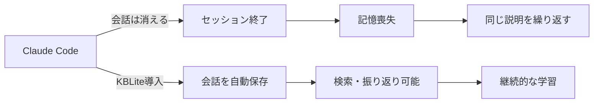
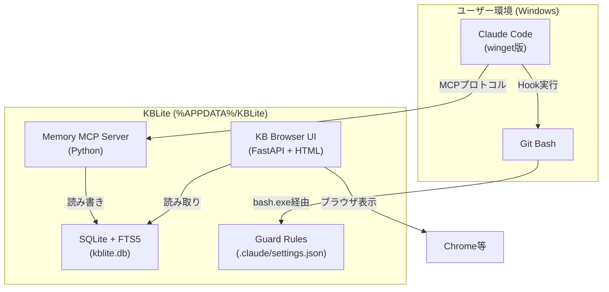
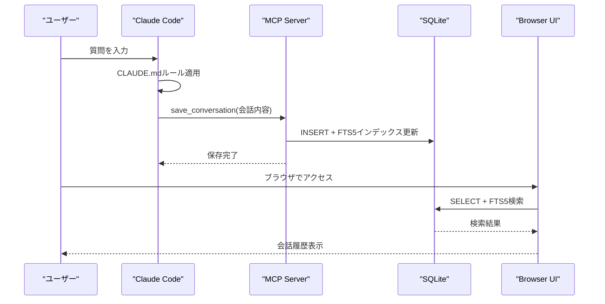
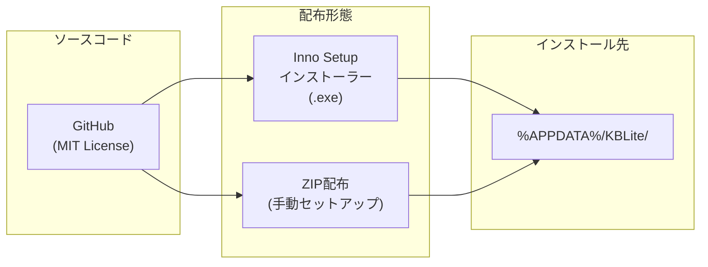

# KBLite 概要設計書

| 項目 | 内容 |
|------|------|
| 文書ID | DESIGN-001 |
| 作成日 | 2026-04-14 |
| バージョン | 1.0 |
| ステータス | ドラフト |

---

## 1. プロジェクト概要

### 1.1 プロダクト名
**KBLite** — Claude Code用 軽量ナレッジブラウザ

### 1.2 目的
Claude Code初心者が**すぐに使える会話記憶・検索ツール**をOSSとして無料配布する。

| 目標 | 詳細 |
|------|------|
| 主目標 | Claude Codeの会話履歴・ユーザーメモを永続化し、ブラウザで閲覧・検索可能にする |
| 副目標 | OSS公開を通じた認知拡大・AI関連の仕事獲得 |
| 非目標 | RAGベクター検索、外部クローラー、マルチユーザー対応 |

### 1.3 背景

Claude Codeはセッション終了時に会話履歴が消失する。
KBLiteは会話内容をSQLiteに永続化し、ブラウザUIで検索・閲覧できるようにする。

### 1.4 ターゲットユーザー
- Claude Code初心者（プログラミング経験が浅い層を含む）
- WSL/Docker未導入のWindows環境ユーザー
- 会話履歴を残したい・振り返りたいユーザー

---

## 2. システム全体構成

### 2.1 コンポーネント一覧

| # | コンポーネント | 技術 | 役割 |
|---|--------------|------|------|
| 1 | Memory MCP Server | Python + MCP SDK | 会話・メモの保存・検索API |
| 2 | KB Browser UI | FastAPI + Jinja2 + HTML/CSS/JS | 保存データのブラウザ閲覧・検索 |
| 3 | SQLite + FTS5 | sqlite3 (Python標準) | データ永続化 + 全文検索 |
| 4 | Guard Rules | Shell Script (.sh) | Claude Codeの品質・安全ガードレール |
| 5 | Inno Setup Installer | Inno Setup 6 | Windows向けインストーラー |

### 2.2 コンポーネント間の連携

---

## 3. 機能一覧

### 3.1 MCP Serverツール（5本）

| # | ツール名 | 機能 | 呼び出し元 |
|---|----------|------|-----------|
| 1 | `save_conversation` | 会話内容（質問+回答）をセッション単位で保存 | Claude Code (自動) |
| 2 | `search_conversations` | 保存済み会話をキーワード検索（FTS5） | Claude Code |
| 3 | `save_memory` | ユーザーメモ・学習事項を保存 | Claude Code |
| 4 | `search_memories` | メモをキーワード検索（FTS5） | Claude Code |
| 5 | `list_sessions` | セッション一覧を取得 | Claude Code / Browser UI |

### 3.2 Browser UI機能

| # | 機能 | 説明 |
|---|------|------|
| 1 | 会話履歴一覧 | セッション別に会話を時系列表示 |
| 2 | 全文検索 | FTS5による高速キーワード検索 |
| 3 | Markdown描画 | 回答内のMarkdownをレンダリング |
| 4 | Mermaid描画 | Mermaid図の自動描画 |
| 5 | コピー/印刷 | 会話内容のクリップボードコピー・印刷 |

### 3.3 Guard Rules機能

| # | ファイル | 機能 |
|---|---------|------|
| 1 | `session-start.sh` | セッション開始時のコンテキスト注入 |
| 2 | `prompt-guard.sh` | プロンプトインジェクション防御 |
| 3 | `commit-reminder.sh` | コミット忘れ防止リマインダー |
| 4 | `python-quality-gate.sh` | Python品質チェック |

---

## 4. 技術スタック

| レイヤー | 技術 | 選定理由 |
|---------|------|---------|
| 言語 | Python 3.10+ | Claude Code MCP SDKがPython対応、初心者でも読みやすい |
| Webフレームワーク | FastAPI + Uvicorn | 軽量・高速・標準的 |
| テンプレート | Jinja2 | FastAPI標準対応、シンプル |
| データベース | SQLite 3 | Python標準搭載、外部依存ゼロ |
| 全文検索 | FTS5 (unicode61) | SQLite組込み、日本語文字単位検索対応 |
| フロントエンド | Vanilla HTML/CSS/JS | フレームワーク不要、軽量 |
| Markdownレンダリング | marked.js | MIT License、軽量 |
| Mermaid描画 | mermaid.js | MIT License、広く普及 |
| インストーラー | Inno Setup 6 | Windows標準、無料、日本語対応 |
| Guard Rules実行 | Git Bash (bash.exe) | Git for Windows同梱、追加インストール不要 |

---

## 5. 対象環境

### 5.1 必須環境

| 項目 | 要件 |
|------|------|
| OS | Windows 10 (21H2以降) / Windows 11 |
| Git | Git for Windows 2.40+ |
| Claude Code | winget版 (最新) |
| Python | Python 3.10+（pip利用可能） |
| ブラウザ | Chrome 108+ / Edge 108+ |
| ディスク | 100MB以上の空き（DB成長分除く） |

### 5.2 不要なもの（明示的に除外）

| 不要 | 理由 |
|------|------|
| WSL / WSL2 | Git Bash + Pythonで完結 |
| Docker / Docker Desktop | SQLiteはファイルDB、コンテナ不要 |
| Node.js | フロントエンドはVanilla JS |
| 外部サーバー | 全てローカル完結 |

---

## 6. 配布形態

| 項目 | 内容 |
|------|------|
| リポジトリ | GitHub (Public) |
| ライセンス | MIT License |
| 配布形式1 | Inno Setupインストーラー (.exe)（推奨） |
| 配布形式2 | ZIPアーカイブ（上級者向け） |
| インストール先 | `%APPDATA%\KBLite\` |
| 価格 | 無料 |

---

## 7. セキュリティ方針

| 方針 | 詳細 |
|------|------|
| ローカル専用 | 外部通信なし。全データはローカルマシン上に保持 |
| UI公開範囲 | `127.0.0.1` のみバインド（外部アクセス不可） |
| 認証 | なし（ローカル単一ユーザー前提） |
| データ暗号化 | なし（OS標準のファイルシステム暗号化に依存） |

> **All conversations stay on your machine. No external transmission.**

---

## 8. プロジェクトスコープ

### 8.1 Phase 1（MVP）
- Memory MCP Server（5ツール）
- SQLite + FTS5データベース
- CLAUDE.md自動記憶ルール

### 8.2 Phase 2
- KB Browser UI（閲覧・検索）
- Guard Rules統合

### 8.3 Phase 3
- Inno Setupインストーラー
- GitHub公開・README作成

### 8.4 スコープ外（将来検討）
- ベクター検索（ChromaDB統合）
- 外部クローラー
- マルチユーザー対応
- クラウド同期
