# KBLite 基本設計書

| 項目 | 内容 |
|------|------|
| 文書ID | DESIGN-002 |
| 作成日 | 2026-04-14 |
| バージョン | 1.0 |
| ステータス | ドラフト |
| 前提文書 | DESIGN-001 KBLite概要設計書 |

---

## 1. アーキテクチャ設計

### 1.1 レイヤー構成

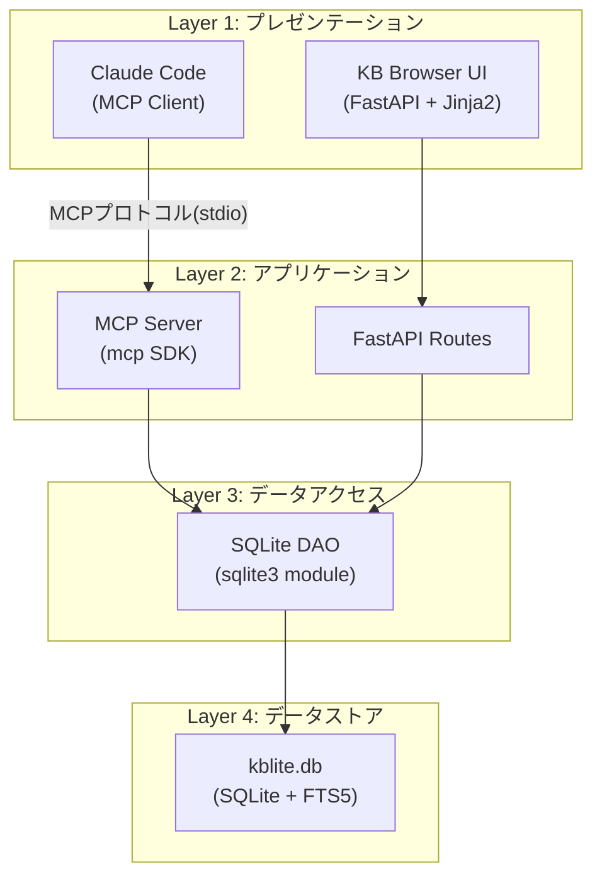

### 1.2 コンポーネント詳細

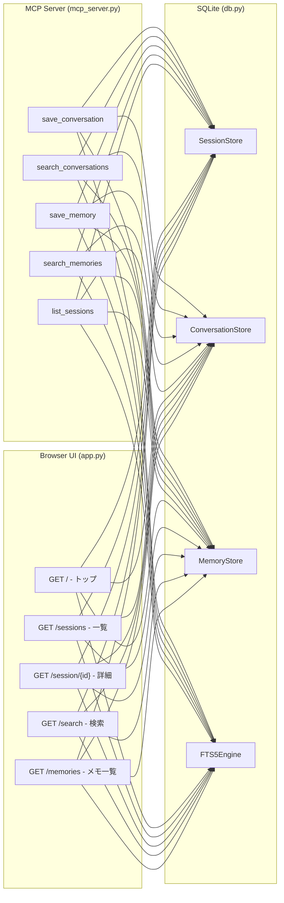

---

## 2. ディレクトリ構成

### 2.1 ソースコード構成

```
kblite/
├── doc/                          # 設計書
│   ├── DESIGN-001_kblite-overview.md
│   └── DESIGN-002_kblite-basic-design.md
├── src/
│   ├── mcp_server.py             # MCP Server本体（5ツール定義）
│   ├── app.py                    # Browser UI（FastAPI）
│   ├── db.py                     # SQLite DAO（データアクセス）
│   └── templates/
│       ├── base.html             # 共通レイアウト
│       ├── index.html            # トップページ
│       ├── sessions.html         # セッション一覧
│       ├── session_detail.html   # セッション詳細
│       ├── search.html           # 検索結果
│       └── memories.html         # メモ一覧
├── static/
│   ├── css/
│   │   └── style.css             # スタイルシート
│   └── js/
│       └── main.js               # クライアントサイドJS
├── guard-rules/
│   ├── hooks/
│   │   ├── session-start.sh      # セッション開始フック
│   │   ├── prompt-guard.sh       # プロンプトガード
│   │   ├── commit-reminder.sh    # コミットリマインダー
│   │   └── python-quality-gate.sh # Python品質ゲート
│   └── rules/
│       ├── bash-timeout.md       # Bashタイムアウトルール
│       ├── config-change.md      # 設定変更ルール
│       ├── git-workflow.md       # Gitワークフロールール
│       └── destructive-ops.md    # 破壊的操作ルール
├── installer/
│   └── kblite-setup.iss          # Inno Setupスクリプト
├── CLAUDE.md                     # Claude Code自動記憶ルール
├── settings.template.json        # Claude Code設定テンプレート
├── requirements.txt              # Python依存パッケージ
├── LICENSE                       # MIT License
└── README.md                     # GitHub README
```

### 2.2 インストール後の配置（Windows）

```
%APPDATA%\KBLite\
├── src/                          # アプリケーション本体
├── static/                       # 静的ファイル
├── data/
│   └── kblite.db                 # SQLiteデータベース
├── guard-rules/                  # Guard Rulesファイル
├── CLAUDE.md                     # 自動記憶ルール
└── settings.template.json        # 設定テンプレート
```

---

## 3. データベース設計

### 3.1 ER図

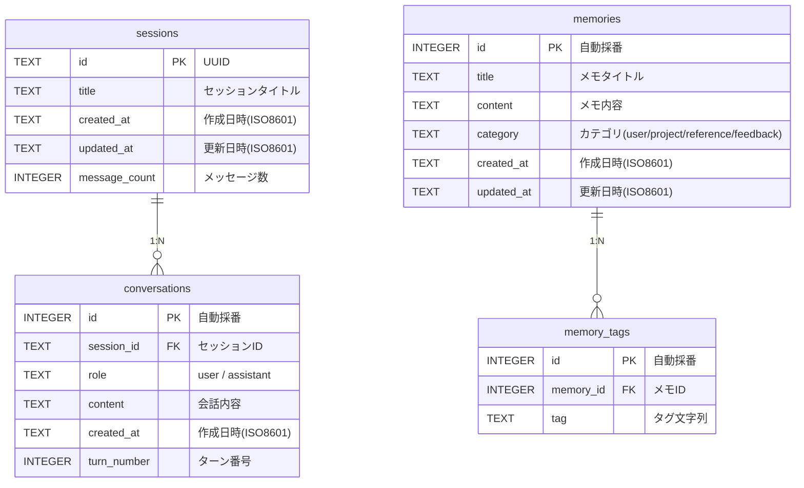

### 3.2 テーブル定義

#### 3.2.1 sessions（セッション管理）

| カラム | 型 | 制約 | 説明 |
|--------|-----|------|------|
| id | TEXT | PK | UUID v4 |
| title | TEXT | NOT NULL | セッションの要約タイトル |
| created_at | TEXT | NOT NULL | 作成日時（ISO 8601） |
| updated_at | TEXT | NOT NULL | 最終更新日時 |
| message_count | INTEGER | DEFAULT 0 | 会話メッセージ数 |

```sql
CREATE TABLE IF NOT EXISTS sessions (
    id TEXT PRIMARY KEY,
    title TEXT NOT NULL,
    created_at TEXT NOT NULL DEFAULT (datetime('now')),
    updated_at TEXT NOT NULL DEFAULT (datetime('now')),
    message_count INTEGER DEFAULT 0
);

CREATE INDEX idx_sessions_created ON sessions(created_at DESC);
```

#### 3.2.2 conversations（会話内容）

| カラム | 型 | 制約 | 説明 |
|--------|-----|------|------|
| id | INTEGER | PK AUTOINCREMENT | 自動採番 |
| session_id | TEXT | FK → sessions.id | セッションID |
| role | TEXT | NOT NULL | 'user' or 'assistant' |
| content | TEXT | NOT NULL | 会話テキスト |
| created_at | TEXT | NOT NULL | 発言日時 |
| turn_number | INTEGER | NOT NULL | ターン番号（セッション内） |

```sql
CREATE TABLE IF NOT EXISTS conversations (
    id INTEGER PRIMARY KEY AUTOINCREMENT,
    session_id TEXT NOT NULL REFERENCES sessions(id) ON DELETE CASCADE,
    role TEXT NOT NULL CHECK(role IN ('user', 'assistant')),
    content TEXT NOT NULL,
    created_at TEXT NOT NULL DEFAULT (datetime('now')),
    turn_number INTEGER NOT NULL
);

CREATE INDEX idx_conv_session ON conversations(session_id, turn_number);
```

#### 3.2.3 memories（ユーザーメモ）

| カラム | 型 | 制約 | 説明 |
|--------|-----|------|------|
| id | INTEGER | PK AUTOINCREMENT | 自動採番 |
| title | TEXT | NOT NULL | メモタイトル |
| content | TEXT | NOT NULL | メモ本文 |
| category | TEXT | NOT NULL | カテゴリ |
| created_at | TEXT | NOT NULL | 作成日時 |
| updated_at | TEXT | NOT NULL | 更新日時 |

```sql
CREATE TABLE IF NOT EXISTS memories (
    id INTEGER PRIMARY KEY AUTOINCREMENT,
    title TEXT NOT NULL,
    content TEXT NOT NULL,
    category TEXT NOT NULL DEFAULT 'general'
        CHECK(category IN ('user', 'project', 'reference', 'feedback', 'general')),
    created_at TEXT NOT NULL DEFAULT (datetime('now')),
    updated_at TEXT NOT NULL DEFAULT (datetime('now'))
);

CREATE INDEX idx_memories_category ON memories(category);
CREATE INDEX idx_memories_updated ON memories(updated_at DESC);
```

#### 3.2.4 memory_tags（メモタグ）

```sql
CREATE TABLE IF NOT EXISTS memory_tags (
    id INTEGER PRIMARY KEY AUTOINCREMENT,
    memory_id INTEGER NOT NULL REFERENCES memories(id) ON DELETE CASCADE,
    tag TEXT NOT NULL
);

CREATE INDEX idx_tags_memory ON memory_tags(memory_id);
CREATE INDEX idx_tags_tag ON memory_tags(tag);
```

### 3.3 FTS5 仮想テーブル

```sql
-- 会話内容の全文検索
CREATE VIRTUAL TABLE IF NOT EXISTS conversations_fts USING fts5(
    content,
    content='conversations',
    content_rowid='id',
    tokenize='unicode61'
);

-- メモの全文検索
CREATE VIRTUAL TABLE IF NOT EXISTS memories_fts USING fts5(
    title,
    content,
    content='memories',
    content_rowid='id',
    tokenize='unicode61'
);
```

#### FTS5トリガー（同期用）

```sql
-- conversations → conversations_fts 同期
CREATE TRIGGER conversations_ai AFTER INSERT ON conversations BEGIN
    INSERT INTO conversations_fts(rowid, content) VALUES (new.id, new.content);
END;

CREATE TRIGGER conversations_ad AFTER DELETE ON conversations BEGIN
    INSERT INTO conversations_fts(conversations_fts, rowid, content)
        VALUES('delete', old.id, old.content);
END;

CREATE TRIGGER conversations_au AFTER UPDATE ON conversations BEGIN
    INSERT INTO conversations_fts(conversations_fts, rowid, content)
        VALUES('delete', old.id, old.content);
    INSERT INTO conversations_fts(rowid, content) VALUES (new.id, new.content);
END;

-- memories → memories_fts 同期
CREATE TRIGGER memories_ai AFTER INSERT ON memories BEGIN
    INSERT INTO memories_fts(rowid, title, content)
        VALUES (new.id, new.title, new.content);
END;

CREATE TRIGGER memories_ad AFTER DELETE ON memories BEGIN
    INSERT INTO memories_fts(memories_fts, rowid, title, content)
        VALUES('delete', old.id, old.title, old.content);
END;

CREATE TRIGGER memories_au AFTER UPDATE ON memories BEGIN
    INSERT INTO memories_fts(memories_fts, rowid, title, content)
        VALUES('delete', old.id, old.title, old.content);
    INSERT INTO memories_fts(rowid, title, content)
        VALUES (new.id, new.title, new.content);
END;
```

### 3.4 FTS5検索仕様

| 項目 | 仕様 |
|------|------|
| tokenizer | `unicode61`（Unicode文字境界で分割） |
| 日本語対応 | 文字単位分解（形態素解析なし）。「東京都」→「東」「京」「都」に分割されるためノイズあり。v1はこの制約を許容し、将来的にtrigramやICU tokenizerの導入を検討する |
| 検索クエリ | `MATCH 'キーワード'`（AND結合はスペース区切り） |
| ランキング | `bm25()` 関数によるスコアリング |
| ハイライト | `highlight()` 関数（検索結果表示時） |
| スニペット | `snippet()` 関数（要約表示） |

```sql
-- 検索例: 会話からキーワード検索
SELECT c.*, s.title as session_title,
       highlight(conversations_fts, 0, '<mark>', '</mark>') as highlighted
FROM conversations_fts
JOIN conversations c ON c.id = conversations_fts.rowid
JOIN sessions s ON s.id = c.session_id
WHERE conversations_fts MATCH 'キーワード'
ORDER BY bm25(conversations_fts)
LIMIT 20;
```

---

## 4. MCP Server設計

### 4.1 プロトコル

| 項目 | 仕様 |
|------|------|
| 通信方式 | stdio（標準入出力） |
| プロトコル | MCP (Model Context Protocol) |
| SDK | `mcp` Python SDK |
| 起動コマンド | `python src/mcp_server.py` |

### 4.2 ツール定義

#### 4.2.1 save_conversation

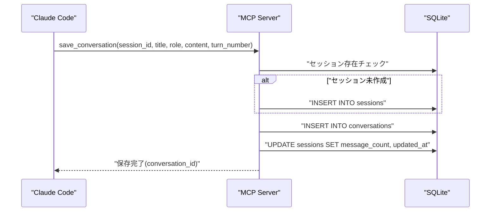

| パラメータ | 型 | 必須 | 説明 |
|-----------|-----|------|------|
| session_id | string | Yes | セッションID（UUID v4） |
| title | string | No | セッションタイトル（初回のみ） |
| role | string | Yes | 'user' or 'assistant' |
| content | string | Yes | 会話テキスト |
| turn_number | integer | Yes | ターン番号 |

**戻り値**: `{ "conversation_id": int, "session_id": string }`

#### 4.2.2 search_conversations

| パラメータ | 型 | 必須 | 説明 |
|-----------|-----|------|------|
| query | string | Yes | 検索キーワード |
| limit | integer | No | 最大件数（デフォルト: 20） |
| session_id | string | No | 特定セッションに限定 |

**戻り値**: `{ "results": [{ "session_id", "session_title", "role", "content", "highlighted", "created_at" }] }`

#### 4.2.3 save_memory

| パラメータ | 型 | 必須 | 説明 |
|-----------|-----|------|------|
| title | string | Yes | メモタイトル |
| content | string | Yes | メモ内容 |
| category | string | No | カテゴリ（デフォルト: 'general'） |
| tags | string[] | No | タグ配列 |

**戻り値**: `{ "memory_id": int }`

#### 4.2.4 search_memories

| パラメータ | 型 | 必須 | 説明 |
|-----------|-----|------|------|
| query | string | Yes | 検索キーワード |
| category | string | No | カテゴリフィルタ |
| limit | integer | No | 最大件数（デフォルト: 20） |

**戻り値**: `{ "results": [{ "id", "title", "content", "category", "tags", "highlighted", "created_at" }] }`

#### 4.2.5 list_sessions

| パラメータ | 型 | 必須 | 説明 |
|-----------|-----|------|------|
| limit | integer | No | 最大件数（デフォルト: 50） |
| offset | integer | No | オフセット（デフォルト: 0） |

**戻り値**: `{ "sessions": [{ "id", "title", "created_at", "updated_at", "message_count" }], "total": int }`

---

## 5. Browser UI設計

### 5.1 画面遷移図

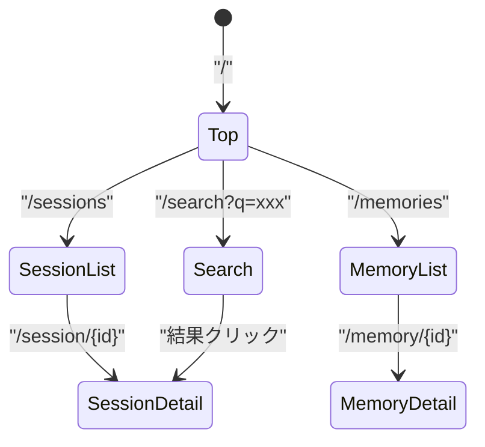

### 5.2 画面一覧

| # | 画面 | URL | 機能 |
|---|------|-----|------|
| 1 | トップ | `/` | ダッシュボード（最新会話・統計） |
| 2 | セッション一覧 | `/sessions` | セッションの時系列リスト |
| 3 | セッション詳細 | `/session/{id}` | 会話内容の表示（Markdown/Mermaid描画） |
| 4 | 検索 | `/search?q={keyword}` | FTS5全文検索結果 |
| 5 | メモ一覧 | `/memories` | ユーザーメモのリスト |
| 6 | メモ詳細 | `/memory/{id}` | メモ内容の表示 |

### 5.3 UI構成（トップページ）

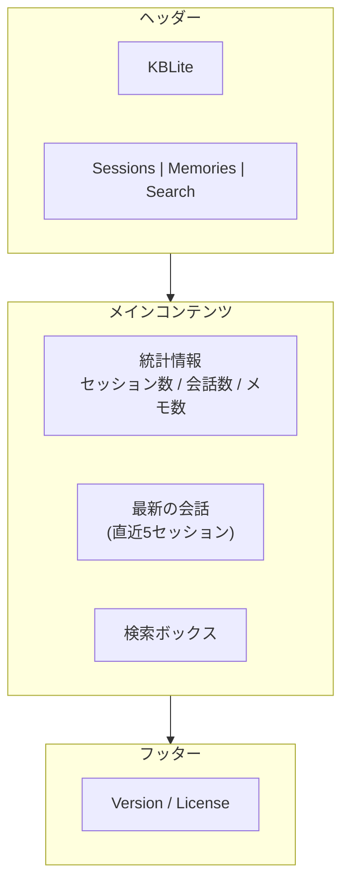

### 5.4 Markdown/Mermaid描画

| 機能 | ライブラリ | CDN/ローカル |
|------|----------|-------------|
| Markdown描画 | marked.js | ローカル同梱 |
| コードハイライト | highlight.js | ローカル同梱 |
| Mermaid図 | mermaid.js (v11) | ローカル同梱 |
| DOMサニタイズ | DOMPurify | ローカル同梱 |

ローカル専用アプリのためCDN依存を排除し、全ライブラリを同梱する。

### 5.5 サーバー設定

| 項目 | 値 |
|------|-----|
| バインドアドレス | `127.0.0.1` |
| ポート | `8780`（デフォルト） |
| 起動コマンド | `python src/app.py` |
| 自動起動 | Windowsタスクスケジューラ登録（オプション） |

---

## 6. Claude Code連携設計

### 6.1 CLAUDE.md テンプレート

Claude Codeが会話を自動保存するためのルールを`CLAUDE.md`に記載する。

```markdown
# KBLite 自動記憶ルール

## 会話の自動保存
各ターンの終了時に、必ず以下のMCPツールを呼び出して会話を保存すること:

1. ユーザーの質問を `save_conversation(role="user")` で保存
2. 自分の回答を `save_conversation(role="assistant")` で保存

## メモの保存
ユーザーから「覚えておいて」「記憶して」と言われた場合:
- `save_memory` で内容を保存する

## 過去の会話の検索
ユーザーから「前に話した〜」「以前の〜」と言われた場合:
- `search_conversations` で過去の会話を検索する
```

### 6.2 settings.json テンプレート

```json
{
  "mcpServers": {
    "kblite": {
      "command": "python",
      "args": ["%APPDATA%/KBLite/src/mcp_server.py"],
      "env": {
        "KBLITE_DB_PATH": "%APPDATA%/KBLite/data/kblite.db"
      }
    }
  },
  "hooks": {
    "SessionStart": [
      {
        "matcher": "",
        "hooks": [
          {
            "type": "command",
            "command": "bash.exe %APPDATA%/KBLite/guard-rules/hooks/session-start.sh"
          }
        ]
      }
    ],
    "PreToolUse": [
      {
        "matcher": "",
        "hooks": [
          {
            "type": "command",
            "command": "bash.exe %APPDATA%/KBLite/guard-rules/hooks/prompt-guard.sh"
          }
        ]
      }
    ]
  }
}
```

### 6.3 自動保存フロー

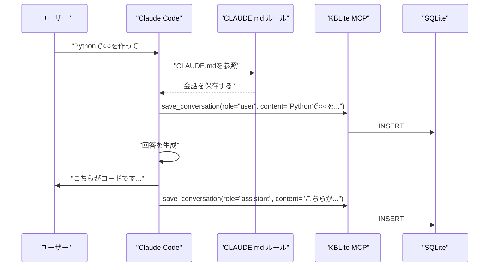

---

## 7. Guard Rules設計

### 7.1 Hookファイル一覧

| ファイル | イベント | 機能 |
|---------|---------|------|
| `session-start.sh` | SessionStart | KBLiteコンテキスト注入（DB統計等）+ 前回未保存会話の検出・警告 |
| `prompt-guard.sh` | PreToolUse | プロンプトインジェクション検出 |
| `commit-reminder.sh` | PostToolUse | 未コミット変更のリマインド |
| `python-quality-gate.sh` | PreToolUse | Python lint/format チェック |

### 7.2 Rulesファイル一覧

| ファイル | 内容 |
|---------|------|
| `bash-timeout.md` | Bashコマンドのタイムアウト設定ルール |
| `config-change.md` | 設定ファイル変更時の確認ルール |
| `git-workflow.md` | Gitブランチ運用ルール |
| `destructive-ops.md` | 破壊的操作の防止ルール |

### 7.3 Git Bash互換性

Git for WindowsのGit Bash（MinGW）環境での実行を前提とする。

| 対応 | 詳細 |
|------|------|
| シェル | bash.exe (Git Bash同梱) |
| パス形式 | `/c/Users/xxx/` 形式（自動変換） |
| 利用可能コマンド | bash, grep, awk, sed, cat, wc, date |
| 非対応 | systemd, cron, apt/yum |

settings.jsonのhookコマンドは `bash.exe` 経由で呼び出す:
```
bash.exe %APPDATA%/KBLite/guard-rules/hooks/session-start.sh
```

---

## 8. インストーラー設計（Inno Setup）

### 8.1 インストールフロー

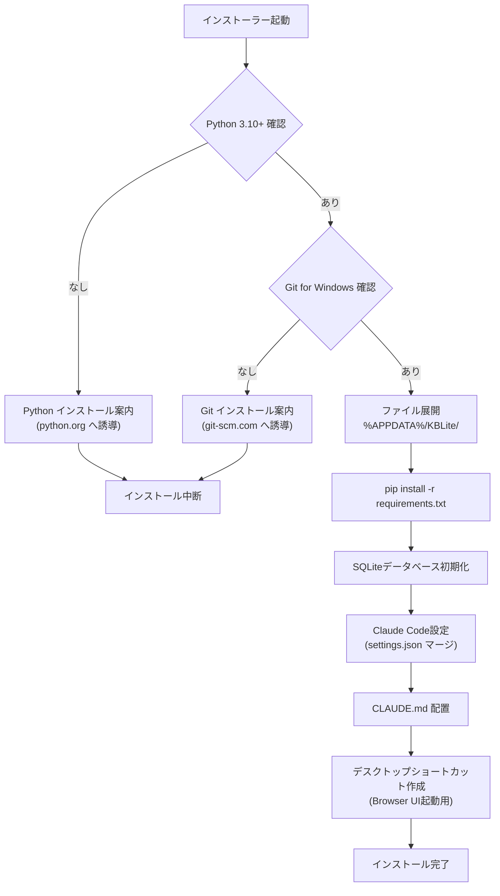

### 8.2 前提条件チェック

| チェック | 方法 | 失敗時のアクション |
|---------|------|------------------|
| Python 3.10+ | `python --version` or `python3 --version` | python.org へ誘導 |
| pip | `pip --version` | Python再インストール案内 |
| Git for Windows | `git --version` | git-scm.com へ誘導 |
| Claude Code | `claude --version` | wingetインストール案内 |

### 8.3 settings.json マージ戦略

既存の `~/.claude/settings.json` がある場合、KBLiteの設定を**マージ**する（上書きしない）。

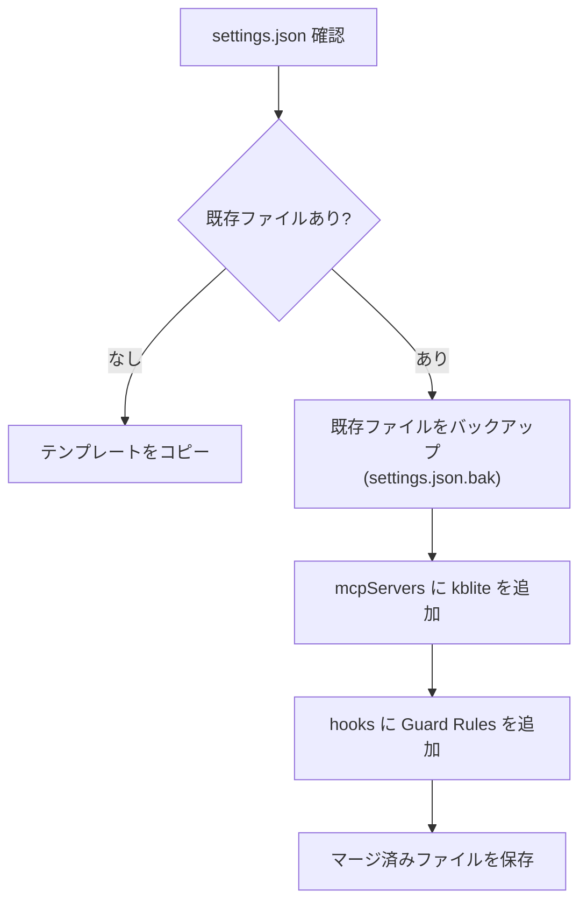

### 8.4 パス展開の注意

settings.json内のパスにWindows環境変数（`%APPDATA%`等）を記述しても、Claude Codeが展開できる保証はない。
Inno Setupインストール時に**絶対パスに展開して書き込む**こと。

例: `%APPDATA%/KBLite/src/mcp_server.py` → `C:/Users/76hata/AppData/Roaming/KBLite/src/mcp_server.py`

### 8.5 requirements.txt

```
mcp>=1.0.0
fastapi>=0.110.0
uvicorn>=0.27.0
jinja2>=3.1.0
```

Python標準ライブラリで提供されるもの（sqlite3, uuid, json, datetime）は含めない。

---

## 9. セキュリティ設計

### 9.1 セキュリティ原則

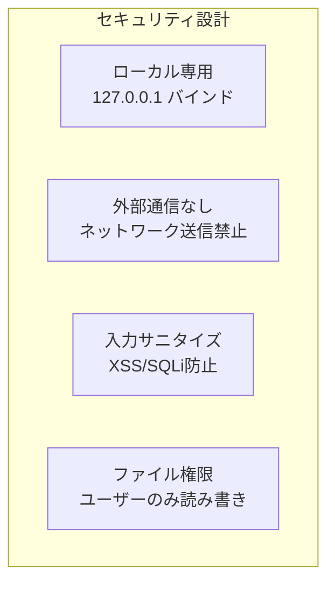

### 9.2 脅威と対策

| 脅威 | リスク | 対策 |
|------|--------|------|
| XSS | ユーザー入力のHTML注入 | DOMPurifyでサニタイズ + Jinja2の自動エスケープ |
| SQLインジェクション | 不正なSQL実行 | パラメータバインディング（`?` プレースホルダ） |
| 外部からのアクセス | ネットワーク経由のDB読み取り | `127.0.0.1` バインド（localhost限定） |
| プロンプトインジェクション | 悪意あるプロンプト注入 | prompt-guard.sh でフィルタリング |
| データ漏洩 | DB内の会話情報流出 | ローカルファイルシステムのみ、外部送信なし |

### 9.3 DOMPurify設定

```javascript
// Markdown描画後のサニタイズ
const clean = DOMPurify.sanitize(marked.parse(rawContent), {
    ALLOWED_TAGS: ['h1','h2','h3','h4','h5','h6','p','a','ul','ol','li',
                   'code','pre','blockquote','table','thead','tbody','tr',
                   'th','td','strong','em','br','hr','img','mark','span'],
    ALLOWED_ATTR: ['href','src','alt','class','id']
});
```

---

## 10. 非機能要件

| 項目 | 要件 |
|------|------|
| パフォーマンス | FTS5検索: 10万件以下で100ms以内 |
| ストレージ | 初期: 約50MB（ライブラリ含む）、DB成長: 1会話あたり約1-5KB |
| 可用性 | ローカルアプリのため冗長化不要 |
| バックアップ | kblite.dbファイルのコピーで完結 |
| ログ | `data/kblite.log`（ローテーション: 5MB x 3世代） |
| エラーハンドリング | DB接続失敗時はリトライ（最大3回）→ エラー表示 |

---

## 11. テスト方針

| テスト種別 | 対象 | ツール |
|-----------|------|--------|
| ユニットテスト | db.py (DAO層) | pytest + sqlite3 (in-memory) |
| 統合テスト | MCP Server (ツール全体) | pytest + MCP SDK テストクライアント |
| UIテスト | Browser UI表示・操作 | 手動テスト（初回リリース） |
| インストーラーテスト | Inno Setup動作 | Windows実機テスト |

---

## 12. 実装計画

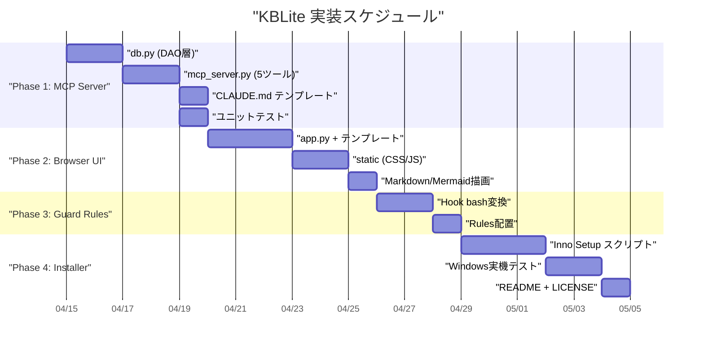

| Phase | 内容 | 見積もり |
|-------|------|---------|
| Phase 1 | MCP Server + DB + テスト | 5日 |
| Phase 2 | Browser UI | 6日 |
| Phase 3 | Guard Rules bash変換 | 3日 |
| Phase 4 | Inno Setup + README | 6日 |
| **合計** | | **20日** |
