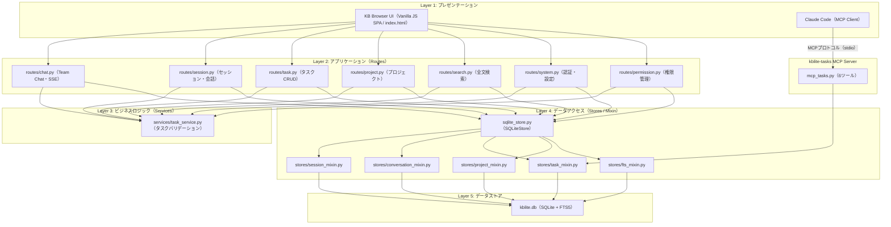
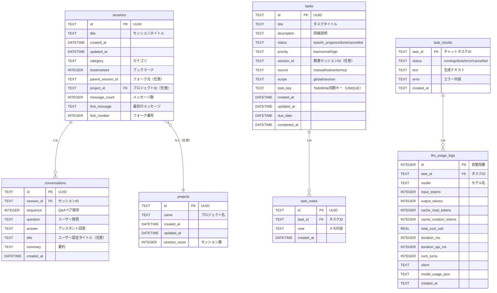
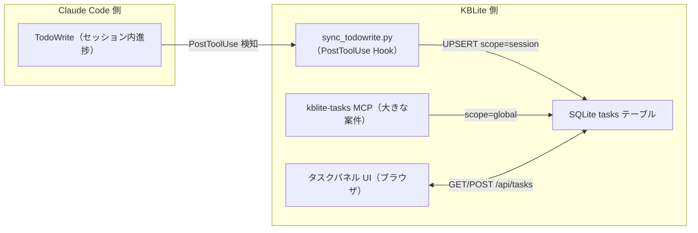
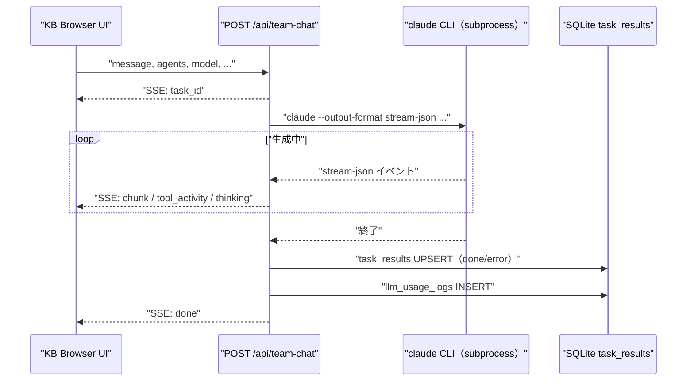
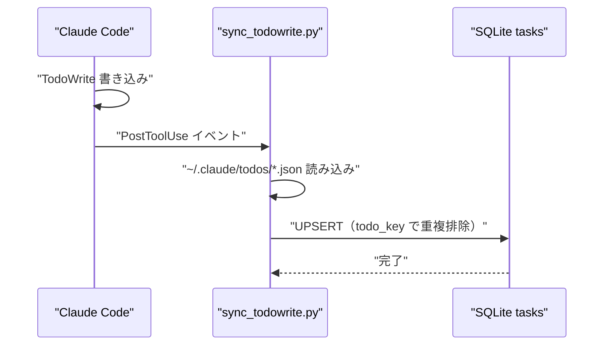
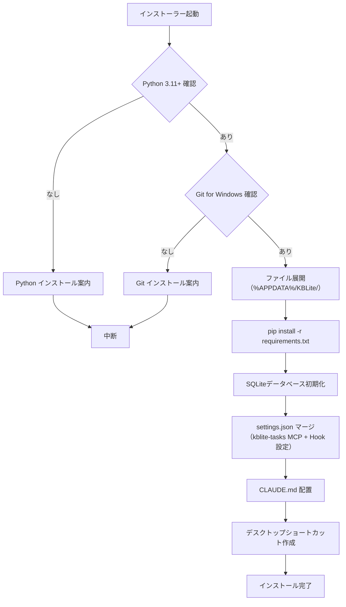
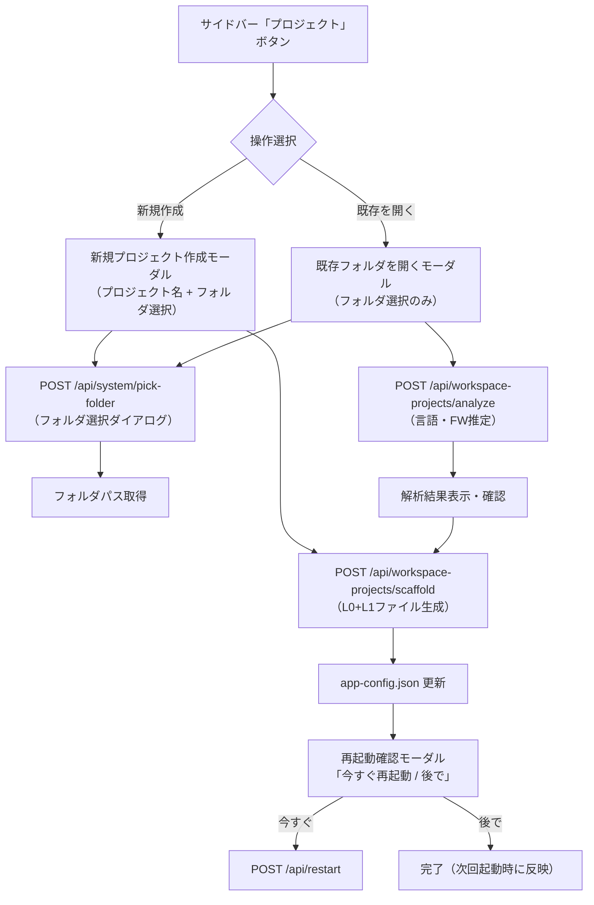

# KBLite 基本設計書

| 項目 | 内容 |
|------|------|
| 文書ID | DESIGN-002 |
| 作成日 | 2026-04-14 |
| 最終更新 | 2026-04-23 |
| バージョン | 2.0 |
| ステータス | 更新中（実装反映済み） |
| 前提文書 | DESIGN-001 KBLite概要設計書 |

---

## 1. アーキテクチャ設計

### 1.1 レイヤー構成



### 1.2 Mixin合成パターン

`SQLiteStore` は複数のMixinを多重継承し、テーブル操作の関心を分離する。

```python
class SQLiteStore(SessionMixin, ConversationMixin, ProjectMixin, FtsMixin, TaskMixin):
    pass
```

各Mixinが担当するテーブル：

| Mixin | 担当テーブル |
|-------|------------|
| SessionMixin | sessions |
| ConversationMixin | conversations |
| TaskMixin | tasks, task_notes |
| ProjectMixin | projects |
| FtsMixin | conversations_fts（FTS5仮想テーブル） |

チャットルートが独自に管理するテーブル：

| テーブル | 管理箇所 |
|---------|---------|
| task_results | routes/chat.py |
| llm_usage_logs | routes/chat.py |

---

## 2. ディレクトリ構成

### 2.1 ソースコード構成（実装反映版）

```
kblite/
├── doc/                              # 設計書
│   ├── DESIGN-001_kblite-overview.md
│   └── DESIGN-002_kblite-basic-design.md
│
├── routes/                           # APIエンドポイント層
│   ├── chat.py                       # Team Chat・AIタスク実行（SSE）
│   ├── session.py                    # セッション・会話管理
│   ├── task.py                       # タスクCRUD
│   ├── project.py                    # プロジェクト管理
│   ├── search.py                     # 全文検索
│   ├── system.py                     # 認証・設定・再起動
│   └── permission.py                 # 権限管理UI
│
├── services/                         # ビジネスロジック層
│   └── task_service.py               # タスクバリデーション・ルール
│
├── stores/                           # データアクセス層（Mixin設計）
│   ├── _base.py                      # StoreMixinBase（共通DBコネクション）
│   ├── session_mixin.py              # sessions CRUD
│   ├── conversation_mixin.py         # conversations CRUD（Q&Aペア）
│   ├── task_mixin.py                 # tasks・task_notes CRUD
│   ├── project_mixin.py              # projects CRUD
│   └── fts_mixin.py                  # FTS5全文検索
│
├── models/                           # データモデル（型定義）
│
├── commands/                         # コマンド層（補助機能）
│
├── scripts/                          # Hook・ユーティリティスクリプト
│   ├── sync_todowrite.py             # TodoWrite同期（PostToolUse）
│   ├── perm_request_hook.py          # 権限申請Hook（PostToolUse）
│   ├── session_start_banner.py       # セッション開始バナー（SessionStart）
│   └── statusline.py                 # ステータスライン出力
│
├── installer/                        # インストーラー関連
│   ├── kblite_installer.py           # PyInstaller/cx_Freezeビルダー
│   ├── build_installer.bat           # Windowsバッチビルド
│   ├── source/                       # 配布用ソースコピー（ミラー）
│   │   ├── app.py
│   │   ├── routes/
│   │   ├── stores/
│   │   └── ...（本体と同構成）
│   ├── build/                        # ビルド中間ファイル
│   └── dist/                         # 最終配布物（.exe / .msi）
│
├── static/                           # フロントエンド静的資産
│   ├── css/
│   ├── js/
│   └── lib/                          # marked.js / mermaid.js / DOMPurify 等
│
├── data/
│   └── sqlite/
│       └── kblite.db                 # SQLiteデータベース本体
│
├── app.py                            # Starletteアプリ本体（エントリーポイント）
├── deps.py                           # 依存性注入・共通設定
├── sqlite_store.py                   # SQLiteStore（Mixin合成クラス）
├── mcp_tasks.py                      # kblite-tasks MCP Server本体
├── prompt.py                         # チームプロンプト構築ロジック
├── statusline.py                     # ステータスライン（ルートレベル）
├── index.html                        # SPA フロントエンド
├── app-config.json                   # アプリ設定（モデル・エージェント・チーム定義）
├── CLAUDE.md                         # Claude Code連携ルール
├── requirements.txt                  # Python依存パッケージ
├── LICENSE                           # MIT License
└── README.md                         # GitHub README
```

### 2.2 インストール後の配置（Windows）

```
%APPDATA%\KBLite\
├── app.py                    # Starletteアプリ（エントリーポイント）
├── routes/                   # APIエンドポイント
├── stores/                   # データアクセス層
├── services/                 # ビジネスロジック
├── scripts/                  # Hook スクリプト
├── static/                   # 静的ファイル
├── index.html                # SPA フロントエンド
├── data/
│   └── sqlite/
│       └── kblite.db         # SQLiteデータベース
├── app-config.json           # アプリ設定
├── CLAUDE.md                 # Claude Code連携ルール
└── requirements.txt          # 依存パッケージ
```

---

## 3. データベース設計

### 3.1 ER図（実装反映版）



### 3.2 テーブル定義

#### sessions

| カラム | 型 | 制約 | 説明 |
|--------|-----|------|------|
| id | TEXT | PK | UUID v4 |
| title | TEXT | NOT NULL | セッションの要約タイトル |
| created_at | DATETIME | DEFAULT now | 作成日時 |
| updated_at | DATETIME | DEFAULT now | 最終更新日時 |
| category | TEXT | DEFAULT '' | カテゴリ文字列 |
| bookmarked | INTEGER | DEFAULT 0 | ブックマークフラグ（0/1） |
| parent_session_id | TEXT | DEFAULT NULL | フォーク元セッションID |
| project_id | TEXT | DEFAULT NULL | 所属プロジェクトID |
| message_count | INTEGER | DEFAULT 0 | Q&Aペア数 |
| first_message | TEXT | DEFAULT '' | 最初のユーザーメッセージ |
| fork_number | INTEGER | DEFAULT 0 | フォーク番号 |

#### conversations

| カラム | 型 | 制約 | 説明 |
|--------|-----|------|------|
| id | TEXT | PK | UUID v4 |
| session_id | TEXT | FK → sessions.id ON DELETE CASCADE | セッションID |
| sequence | INTEGER | DEFAULT 0 | Q&Aペアの順序番号 |
| question | TEXT | DEFAULT '' | ユーザー質問テキスト |
| answer | TEXT | DEFAULT '' | アシスタント回答テキスト |
| title | TEXT | DEFAULT NULL | ユーザー設定タイトル |
| summary | TEXT | DEFAULT '' | 要約テキスト |
| created_at | DATETIME | DEFAULT CURRENT_TIMESTAMP | 作成日時 |

#### projects

| カラム | 型 | 制約 | 説明 |
|--------|-----|------|------|
| id | TEXT | PK | UUID v4 |
| name | TEXT | NOT NULL | プロジェクト名 |
| created_at | DATETIME | DEFAULT now | 作成日時 |
| updated_at | DATETIME | DEFAULT now | 更新日時 |
| session_count | INTEGER | DEFAULT 0 | 所属セッション数 |

#### tasks

| カラム | 型 | 制約 | 説明 |
|--------|-----|------|------|
| id | TEXT | PK | UUID v4 |
| title | TEXT | NOT NULL | タスクタイトル |
| description | TEXT | DEFAULT '' | 詳細説明 |
| status | TEXT | DEFAULT 'todo' | todo / in_progress / done / cancelled |
| priority | TEXT | DEFAULT 'normal' | low / normal / high |
| session_id | TEXT | DEFAULT NULL | 関連セッションID |
| source | TEXT | DEFAULT 'manual' | manual / todowrite / mcp |
| scope | TEXT | DEFAULT 'global' | global / session |
| todo_key | TEXT | UNIQUE（NULL除く） | TodoWrite同期キー（`{session_id}:{todo_id}`） |
| created_at | DATETIME | DEFAULT localtime | 作成日時 |
| updated_at | DATETIME | DEFAULT localtime | 更新日時 |
| due_date | DATETIME | DEFAULT NULL | 期限日時 |
| completed_at | DATETIME | DEFAULT NULL | 完了日時 |

インデックス：
- `UNIQUE INDEX idx_tasks_todo_key ON tasks(todo_key) WHERE todo_key IS NOT NULL`
- `INDEX idx_tasks_scope_status ON tasks(scope, status)`

#### task_notes

| カラム | 型 | 制約 | 説明 |
|--------|-----|------|------|
| id | TEXT | PK | UUID v4 |
| task_id | TEXT | FK → tasks.id ON DELETE CASCADE | タスクID |
| note | TEXT | NOT NULL | メモ内容 |
| created_at | DATETIME | DEFAULT localtime | 作成日時 |

#### task_results（チャットタスク永続化）

| カラム | 型 | 制約 | 説明 |
|--------|-----|------|------|
| task_id | TEXT | PK | チャットタスクUUID |
| status | TEXT | NOT NULL | running / done / error / cancelled |
| text | TEXT | DEFAULT '' | 生成テキスト（累積） |
| error | TEXT | DEFAULT '' | エラーメッセージ |
| created_at | TEXT | NOT NULL | 作成日時 |

#### llm_usage_logs（LLM使用量ログ）

| カラム | 型 | 制約 | 説明 |
|--------|-----|------|------|
| id | INTEGER | PK AUTOINCREMENT | 自動採番 |
| task_id | TEXT | NOT NULL | チャットタスクID |
| model | TEXT | DEFAULT '' | モデル名 |
| input_tokens | INTEGER | DEFAULT 0 | 入力トークン数 |
| output_tokens | INTEGER | DEFAULT 0 | 出力トークン数 |
| cache_read_tokens | INTEGER | DEFAULT 0 | キャッシュ読み込みトークン数 |
| cache_creation_tokens | INTEGER | DEFAULT 0 | キャッシュ作成トークン数 |
| total_cost_usd | REAL | DEFAULT 0 | 推定コスト（USD） |
| duration_ms | INTEGER | DEFAULT 0 | 全体処理時間（ms） |
| duration_api_ms | INTEGER | DEFAULT 0 | API呼び出し時間（ms） |
| num_turns | INTEGER | DEFAULT 0 | ターン数 |
| client | TEXT | DEFAULT '' | クライアント識別子 |
| model_usage_json | TEXT | DEFAULT '{}' | モデル別使用量JSON |
| created_at | TEXT | NOT NULL | 作成日時 |

インデックス：
- `INDEX idx_llm_usage_created ON llm_usage_logs(created_at)`
- `INDEX idx_llm_usage_model ON llm_usage_logs(model)`

### 3.3 FTS5 仮想テーブル

```sql
CREATE VIRTUAL TABLE IF NOT EXISTS conversations_fts USING fts5(
    question,
    answer,
    title,
    content='conversations',
    content_rowid='rowid',
    tokenize='unicode61'
);
```

| 項目 | 仕様 |
|------|------|
| tokenizer | `unicode61`（Unicode文字境界で分割） |
| 日本語対応 | 文字単位分解（形態素解析なし）。v1はこの制約を許容 |
| 検索対象 | question / answer / title の3フィールド |
| ランキング | `bm25()` 関数 |
| ハイライト | `highlight()` 関数 |

> **注意:** 旧設計書に記載されていた `memories` テーブルおよび `memories_fts` は実装されていない。

---

## 4. kblite-tasks MCP Server設計

### 4.1 プロトコル

| 項目 | 仕様 |
|------|------|
| 通信方式 | stdio（標準入出力） |
| プロトコル | MCP（Model Context Protocol） |
| SDK | `mcp` Python SDK |
| 起動コマンド | `python mcp_tasks.py` |
| エンコード | UTF-8（Windows環境でcp932への自動変換を回避するため明示設定） |

### 4.2 ツール定義（6本）

#### task_create

| パラメータ | 型 | 必須 | 説明 |
|-----------|-----|------|------|
| title | string | Yes | タスクタイトル（30文字以内推奨） |
| description | string | No | 詳細説明 |
| priority | string | No | low / normal / high（デフォルト: normal） |
| due_date | string | No | 期限日時（ISO8601） |
| scope | string | No | global / session（デフォルト: global） |

**戻り値**: `{ "task_id": string, "title": string, "status": "todo" }`

#### task_list

| パラメータ | 型 | 必須 | 説明 |
|-----------|-----|------|------|
| status | string | No | todo / in_progress / done / cancelled でフィルタ |
| scope | string | No | global / session でフィルタ |
| source | string | No | manual / todowrite / mcp でフィルタ |
| session_id | string | No | セッションIDでフィルタ |

**戻り値**: `{ "tasks": [{ "id", "title", "description", "status", "priority", "scope", "created_at", "notes" }] }`

#### task_update

| パラメータ | 型 | 必須 | 説明 |
|-----------|-----|------|------|
| task_id | string | Yes | タスクID |
| title | string | No | 新しいタイトル |
| description | string | No | 新しい説明 |
| status | string | No | todo / in_progress / done / cancelled |
| priority | string | No | low / normal / high |
| due_date | string | No | 新しい期限日時 |

**戻り値**: `{ "ok": true, "task": { ...更新後のタスク } }`

#### task_delete

| パラメータ | 型 | 必須 | 説明 |
|-----------|-----|------|------|
| task_id | string | Yes | 削除するタスクID |

**戻り値**: `{ "ok": true }`

#### task_add_note

| パラメータ | 型 | 必須 | 説明 |
|-----------|-----|------|------|
| task_id | string | Yes | タスクID |
| note | string | Yes | メモ内容 |

**戻り値**: `{ "ok": true, "note_id": string }`

#### task_resume_context

パラメータなし。

**戻り値**: `{ "summary": string（Markdown形式）, "tasks": [...未完了タスク一覧] }`

scope=global を優先表示し、session タスクは参考情報として分離して返す。

---

## 5. API一覧表

### 5.1 チャット・AIタスク実行（routes/chat.py）

| メソッド | パス | リクエスト主要パラメータ | レスポンス | 説明 |
|---------|------|----------------------|----------|------|
| POST | `/api/team-chat` | `message`, `agents[]`, `mode`, `model`, `history[]`, `attachments[]`, `session_id`, `workspace_project` | SSE（Server-Sent Events） | AI Team Chat実行。`task_id`, `chunk`, `tool_activity`, `thinking`, `done`, `error`, `waiting` イベントを返す |
| GET | `/api/task/{task_id}` | - | `{ status, text, error }` | チャットタスク結果取得 |
| POST | `/api/task/{task_id}/cancel` | - | `{ ok }` | チャットタスク中止 |
| POST | `/api/chat/save-web-search` | `query`, `content`, `session_id` | `{ ok }` | Web検索結果をステージング保存 |

### 5.2 セッション・会話管理（routes/session.py）

| メソッド | パス | リクエスト主要パラメータ | レスポンス | 説明 |
|---------|------|----------------------|----------|------|
| POST | `/api/sessions` | `session_id`, `title`, `first_message`, `category`, `parent_session_id` | `{ session }` | セッション作成 |
| GET | `/api/sessions` | Query: `project_id`, `offset`, `limit` | `{ sessions[], total }` | セッション一覧 |
| GET | `/api/sessions/{session_id}` | - | `{ session, conversations[] }` | セッション詳細 + 全会話 |
| DELETE | `/api/sessions/{session_id}` | - | `{ ok }` | セッション削除 |
| PUT | `/api/sessions/{session_id}/title` | `title` | `{ ok }` | タイトル変更 |
| PUT | `/api/sessions/{session_id}/bookmark` | `bookmarked` (bool) | `{ ok }` | ブックマーク更新 |
| POST | `/api/conversations` | `session_id`, `sequence`, `question`, `answer`, `title`, `summary` | `{ conversation_id }` | Q&A保存 |
| PUT | `/api/conversations/{conv_id}` | `question`, `answer` | `{ ok }` | 会話内容編集 |
| PUT | `/api/conversations/title` | `conv_id`, `title` | `{ ok }` | 会話タイトル更新 |

### 5.3 タスク管理（routes/task.py）

#### 2層タスク管理の概念

KBLite のタスク管理は Claude Code の `TodoWrite` と kblite-tasks MCP の2ツールを役割分担して使う。



| 種別 | ツール | scope | 用途 |
|------|-------|-------|------|
| セッション内の細かい進捗 | `TodoWrite` | session | 「今から5ファイル順に直す」等 |
| 大きな案件・複数セッション | `kblite-tasks MCP` | global | 「認証リファクタ」「scaffold実装」等 |
| ユーザー手動追加 | タスクパネル「+追加」ボタン | global | ブラウザから直接入力 |

TodoWrite で書き込まれた todo は `sync_todowrite.py` が `~/.claude/todos/*.json` を読み込み、`source=todowrite`, `scope=session` として tasks テーブルに UPSERT する。`todo_key`（`{session_id}:{todo_id}`）でべき等に同期する。

#### タスクAPI

| メソッド | パス | リクエスト主要パラメータ | レスポンス | 説明 |
|---------|------|----------------------|----------|------|
| GET | `/api/tasks` | Query: `status`, `session_id`, `scope`, `source` | `{ tasks[] }` | タスク一覧（フィルタ可） |
| POST | `/api/tasks` | `title`, `description`, `priority`, `due_date`, `scope` | `{ task }` | タスク作成 |
| GET | `/api/tasks/{task_id}` | - | `{ task, notes[] }` | タスク詳細 |
| PUT | `/api/tasks/{task_id}` | 更新フィールド（任意） | `{ task }` | タスク更新 |
| DELETE | `/api/tasks/{task_id}` | - | `{ ok }` | タスク削除 |
| POST | `/api/tasks/{task_id}/notes` | `note` | `{ note_id }` | ノート追加 |

### 5.4 プロジェクト管理（routes/project.py）

KBLite のプロジェクト管理には2系統がある。

| 種別 | 保存場所 | 役割 |
|------|---------|------|
| **DBプロジェクト** | SQLite `projects` テーブル | セッションをフォルダ分類する論理グループ |
| **workspace_projects** | `app-config.json` | CWD・チーム・カテゴリをプロジェクト単位で定義（Claude Code と連携） |

`workspace_projects` の詳細は §5.8 の app-config.json 構造を参照。各エントリの `cwd` を基に `resolve_project_cwd()` で作業ディレクトリを解決し、Team Chat の Claude CLI に渡す。

#### DBプロジェクト API

| メソッド | パス | リクエスト主要パラメータ | レスポンス | 説明 |
|---------|------|----------------------|----------|------|
| POST | `/api/projects` | `name` | `{ project }` | DBプロジェクト作成 |
| GET | `/api/projects` | - | `{ projects[] }` | DBプロジェクト一覧 |
| PUT | `/api/projects/{project_id}` | `name` | `{ ok }` | DBプロジェクト名変更 |
| DELETE | `/api/projects/{project_id}` | - | `{ ok }` | DBプロジェクト削除 |
| PUT | `/api/sessions/move` | `session_id`, `project_id` | `{ ok }` | セッションをDBプロジェクトへ移動 |
| POST | `/api/workspace-projects/scaffold` | `name`, `root_folder`, `language` | `{ ok, path }` | 新規プロジェクトのCLAUDE.md等を自動生成 |
| POST | `/api/workspace-projects/analyze` | `folder` | `{ language, framework, files[] }` | 既存フォルダを解析して言語・FWを推定 |

### 5.5 全文検索（routes/search.py）

| メソッド | パス | リクエスト主要パラメータ | レスポンス | 説明 |
|---------|------|----------------------|----------|------|
| GET | `/api/search` | Query: `q`, `limit` | `{ results[] }` | FTS5全文検索 |
| GET | `/api/search/stats` | - | `{ stats }` | FTS5インデックス統計 |
| POST | `/api/search/rebuild` | - | `{ ok }` | FTS5インデックス再構築 |

### 5.6 認証・システム（routes/system.py）

| メソッド | パス | リクエスト主要パラメータ | レスポンス | 説明 |
|---------|------|----------------------|----------|------|
| GET | `/` | - | HTML | SPA（index.html）返却 |
| GET | `/api/config` | - | `{ config }` | アプリ設定（モデル・エージェント・ワークスペース等） |
| GET | `/api/rate-limits` | - | `{ limits }` | レート制限情報 |
| GET | `/health` | - | `{ ok }` | ヘルスチェック（SQLite接続確認） |
| GET | `/api/auth/status` | - | `{ has_key, method }` | APIキー設定状態 |
| POST | `/api/auth/set-key` | `api_key` | `{ ok }` | APIキー設定（auth.jsonに永続化） |
| DELETE | `/api/auth/clear` | - | `{ ok }` | APIキー削除 |
| POST | `/api/auth/claude-login/start` | - | `{ ok }` | Claude CLIログイン起動（OAuth） |
| GET | `/api/auth/claude-login/status` | - | `{ status, url }` | ログイン進捗状態 |
| DELETE | `/api/auth/claude-login/cancel` | - | `{ ok }` | ログインキャンセル |
| GET | `/api/auth/claude-auth-info` | - | `{ info }` | claude auth status実行結果 |
| GET | `/api/debug-env` | - | `{ env }` | デバッグ情報（Python版、CLIパス等） |
| **POST** | `/api/restart` | - | `{ ok }` | **サーバー自己再起動** |
| POST | `/api/open_file` | `path` | `{ ok }` | ファイルを既定アプリで開く |
| POST | `/api/system/pick-folder` | - | `{ folder }` | PowerShell FolderBrowserDialog を起動してフォルダパスを返す |

### 5.7 権限管理（routes/permission.py）

| メソッド | パス | リクエスト主要パラメータ | レスポンス | 説明 |
|---------|------|----------------------|----------|------|
| GET | `/api/permissions` | - | `{ allow[], deny[] }` | allowリスト取得 |
| POST | `/api/permissions/allow` | `pattern` | `{ ok }` | allowパターン追加 |
| DELETE | `/api/permissions/allow` | `pattern` | `{ ok }` | allowパターン削除 |
| GET | `/api/permissions/requests` | - | `{ requests[] }` | 未処理の権限申請一覧 |
| POST | `/api/permissions/requests` | `tool`, `path`, `reason` | `{ request_id }` | 権限申請投稿（Hookから自動呼び出し） |
| POST | `/api/permissions/requests/{id}/approve` | - | `{ ok }` | 申請承認（allowパターン追加） |
| POST | `/api/permissions/requests/{id}/deny` | - | `{ ok }` | 申請拒否 |

### 5.8 Team Chat詳細仕様

#### app-config.json 構造

Team Chat の動作は `app-config.json` で定義する。インストール後は `%APPDATA%\KBLite\app-config.json`。

```json
{
  "categories": [
    { "system_id": "general", "name": "General" }
  ],
  "internal_system_ids": [],
  "teams": [
    {
      "id": "general",
      "name": "汎用チーム",
      "default_model": "auto",
      "default_category": "general"
    }
  ],
  "models": [
    { "id": "auto", "name": "Auto", "default": true },
    { "id": "claude-opus-4-7", "name": "Opus 4.7" },
    { "id": "claude-sonnet-4-6", "name": "Sonnet 4.6" },
    { "id": "claude-haiku-4-5-20251001", "name": "Haiku 4.5" }
  ],
  "ai_services": [
    { "id": "claude", "name": "Claude Code", "cli": "claude", "default": true }
  ],
  "agents": [],
  "workspace_projects": [
    {
      "id": "kblite",
      "label": "KBLite",
      "cwd": "C:/01_Develop/project/kblite",
      "default_team": "general",
      "default_category": "general"
    }
  ]
}
```

| フィールド | 説明 |
|-----------|------|
| `categories` | チャット会話のカテゴリ定義 |
| `teams` | チームID・名称・デフォルトモデルの一覧 |
| `models` | 選択可能なモデル一覧（`auto` で自動ルーティング） |
| `ai_services` | AIバックエンド定義（CLI実行ファイル名を含む） |
| `agents` | エージェント定義（カスタムエージェント追加用） |
| `workspace_projects` | プロジェクト別のCWD・チーム・カテゴリの紐付け |

#### POST /api/team-chat リクエスト詳細

| パラメータ | 型 | 必須 | 説明 |
|-----------|-----|------|------|
| `message` | string | Yes | ユーザーメッセージ（最大50,000文字） |
| `agents` | string[] | No | 使用するエージェントID一覧 |
| `mode` | string | No | チームID（`teams[].id`）。未指定は "team-it" |
| `model` | string | No | モデルID。`"auto"` で自動ルーティング |
| `category` | string | No | カテゴリID |
| `history` | object[] | No | 直前の会話履歴（コンテキスト継続用） |
| `attachments` | object[] | No | 添付ファイル（最大5件）。type: image/pdf/text |
| `session_id` | string | No | 既存セッションへの追記 |
| `fork_session_id` | string | No | フォーク元セッションID |
| `workspace_project` | string | No | workspace_projects[].id でCWDを解決 |
| `ai_service` | string | No | ai_services[].id（デフォルト: claude） |
| `search_all` | bool | No | 全文検索モード |

#### モデル自動ルーティング（`model: "auto"` 時）

| 条件 | ルーティング先 | 理由 |
|------|--------------|------|
| 添付ファイルあり | Opus 4.7 | ファイル内容の深い分析が必要 |
| メッセージが400文字超 | Opus 4.7 | 複雑な質問 |
| 複雑度キーワードを含む | Opus 4.7 | 設計・分析・セキュリティ等 |
| 3エージェント以上のチーム | Opus 4.7 | 多エージェント討議 |
| 上記以外 | Sonnet 4.6 | シンプルな質問 |

複雑度キーワード例: `設計`, `アーキテクチャ`, `リファクタ`, `セキュリティ`, `脆弱性`, `ER図`, `DB設計`, `要件定義`, `分析`

#### SSEイベント仕様

`POST /api/team-chat` は Server-Sent Events（SSE）でレスポンスをストリーミングする。各行は `data: <JSON>\n\n` 形式。

| イベントタイプ | フィールド | 説明 |
|--------------|----------|------|
| `task_id` | `task_id: string`, `ai_service: string` | ストリーム開始時に1回送信。以後 GET /api/task/{task_id} でポーリング可能 |
| `chunk` | `content: string` | AI生成テキストの差分チャンク |
| `tool_activity` | `tool: string` | ツール呼び出し（WebSearch/WebFetch等）の通知 |
| `thinking` | - | Claude の拡張思考（Extended Thinking）中 |
| `waiting` | `message: string` | 同時実行上限（10タスク）待機中の通知 |
| `heartbeat` | - | 15秒タイムアウト防止用の定期送信 |
| `error` | `message: string` | エラー発生。ストリーム終了 |
| `done` | `web_search_used: bool`, `claude_session_id: string` | 正常完了。ストリーム終了 |

#### 同時実行制御

| 項目 | 値 |
|------|-----|
| 最大同時実行タスク数 | 10 |
| 制御方式 | `asyncio.Semaphore(10)` |
| 待機タイムアウト | 86,430秒（≒24時間） |
| タスク結果TTL | 600秒（10分、インメモリ）、SQLite永続化は7日 |

#### タスク実行フロー



---

## 6. Browser UI設計

### 6.1 アーキテクチャ

KBLite Browser UIはVanilla JS SPAとして実装される。サーバーサイドテンプレート（Jinja2）は廃止され、`/` がindex.htmlを返し、以降はJavaScriptで画面を切り替える。

| 項目 | 値 |
|------|-----|
| 方式 | Vanilla JS SPA（単一index.html） |
| バインドアドレス | `127.0.0.1` |
| ポート | `8080`（デフォルト） |
| 起動コマンド | `python app.py` |
| 自動起動 | Windowsタスクスケジューラ登録（オプション） |

### 6.2 主要画面構成

| 画面 | 機能 | 説明 |
|------|------|------|
| 会話一覧 | 検索・フィルタ | セッション・Q&A一覧をプロジェクト別に表示 |
| 会話詳細 | Markdown/Mermaid/draw.io描画 | 選択セッションの全Q&Aを表示 |
| チームチャット | AI Team Chat実行 | エージェント選択・SSEストリーム受信 |
| タスクパネル | タスク管理（右パネル） | タスク一覧・追加・ステータス変更 |
| プロジェクト管理 | フォルダ分類 | セッションのプロジェクト割り当て |
| 認証設定 | APIキー / Claudeログイン | auth.json管理 |
| 権限管理 | allowリスト / 申請レビュー | settings.json permissions管理 |

### 6.3 Markdown/Mermaid描画

| 機能 | ライブラリ | 配置 |
|------|----------|------|
| Markdown描画 | marked.js | static/lib/同梱 |
| コードハイライト | highlight.js | static/lib/同梱 |
| Mermaid図 | mermaid.js（v11） | static/lib/同梱 |
| draw.io図 | drawio XML解析 | 独自実装 |
| DOMサニタイズ | DOMPurify | static/lib/同梱 |

ローカル専用アプリのためCDN依存を排除し、全ライブラリを同梱する。

---

## 7. Claude Code連携設計

### 7.1 CLAUDE.md 構成

各プロジェクトのCLAUDE.mdは以下のセクションを含む：

```markdown
# KBLite プロジェクト向け Claude Code 設定

## 2層タスク管理ルール
- セッション内細粒度タスク → TodoWrite
- 大きな案件（複数セッション） → kblite-tasks MCP（scope=global）

## セッション再開時の挙動
「前回の続き」等の言及があれば task_resume_context を呼び出す
```

### 7.2 settings.json 設定例（実装版）

```json
{
  "mcpServers": {
    "kblite-tasks": {
      "command": "python",
      "args": ["C:/Users/{username}/AppData/Roaming/KBLite/mcp_tasks.py"]
    }
  },
  "hooks": {
    "PostToolUse": [
      {
        "matcher": "TodoWrite",
        "hooks": [
          {
            "type": "command",
            "command": "python C:/Users/{username}/AppData/Roaming/KBLite/scripts/sync_todowrite.py"
          }
        ]
      },
      {
        "matcher": ".*",
        "hooks": [
          {
            "type": "command",
            "command": "python C:/Users/{username}/AppData/Roaming/KBLite/scripts/perm_request_hook.py"
          }
        ]
      }
    ],
    "SessionStart": [
      {
        "matcher": "",
        "hooks": [
          {
            "type": "command",
            "command": "python C:/Users/{username}/AppData/Roaming/KBLite/scripts/session_start_banner.py"
          }
        ]
      }
    ]
  }
}
```

> **注意:** 旧設計書の `kblite`（Memory MCP）は `kblite-tasks` に置き換わっている。ポートは `8780` ではなく `8080`。

---

## 8. Hook スクリプト設計

### 8.1 Hook一覧

| ファイル | イベント | 機能 |
|---------|---------|------|
| `scripts/sync_todowrite.py` | PostToolUse（TodoWrite matcher） | `~/.claude/todos/*.json` を読み込みtasksテーブルにUPSERT（scope=session, source=todowrite） |
| `scripts/perm_request_hook.py` | PostToolUse（全ツール） | ツールブロック時に `POST /api/permissions/requests` へ自動投稿 |
| `scripts/session_start_banner.py` | SessionStart | 未完了scope=globalタスクをコンテキスト注入 |
| `scripts/statusline.py` | - | ステータスライン情報出力ユーティリティ |

### 8.2 TodoWrite同期フロー



---

## 9. インストーラー設計

### 9.1 インストールフロー



### 9.2 installer/source/ ミラー

`installer/source/` はインストーラーが配布ファイルをバンドルするための本体コードのコピー（ミラー）。以下のファイルが含まれる：

- `app.py`, `deps.py`, `sqlite_store.py`, `mcp_tasks.py`, `prompt.py`
- `routes/`, `stores/`, `services/`, `models/`, `scripts/`
- `static/`, `index.html`, `requirements.txt`, `CLAUDE.md`

**注意:** `installer/source/` のファイルは本体（ルート）の変更に追随して更新すること。ビルド時に自動コピーする仕組みを持つ場合はビルドスクリプトを参照。

### 9.3 requirements.txt（主要依存）

```
mcp>=1.0.0
starlette>=0.36.0
uvicorn>=0.27.0
```

Python標準ライブラリで提供されるもの（sqlite3, uuid, json, datetime等）は含めない。

---

## 10. セキュリティ設計

| 脅威 | リスク | 対策 |
|------|--------|------|
| XSS | ユーザー入力のHTML注入 | DOMPurifyでサニタイズ |
| SQLインジェクション | 不正なSQL実行 | パラメータバインディング（`?` プレースホルダ） |
| 外部アクセス | ネットワーク経由のDB読み取り | `127.0.0.1` バインド（localhost限定） |
| プロンプトインジェクション | 悪意あるプロンプト注入 | perm_request_hook.py でブロック検知 |
| APIキー漏洩 | auth.jsonの流出 | ローカルファイルシステムのみ |

---

## 11. 非機能要件

| 項目 | 要件 |
|------|------|
| パフォーマンス | FTS5検索: 10万件以下で100ms以内 |
| ストレージ | 初期: 約50MB（ライブラリ含む）、DB成長: 1会話あたり約1-5KB |
| 可用性 | ローカルアプリのため冗長化不要 |
| バックアップ | kblite.dbファイルのコピーで完結 |
| ログ | `data/kblite.log`（詳細設計にて確認要） |
| エラーハンドリング | DB接続失敗時はリトライ → エラー表示 |
| ポート | `8080`（デフォルト）。旧設計書の8780から変更済み |

---

## 12. テスト方針

| テスト種別 | 対象 | ツール |
|-----------|------|--------|
| ユニットテスト | stores/（DAO層） | pytest + sqlite3（in-memory） |
| 統合テスト | MCP Server（6ツール） | pytest + MCP SDK テストクライアント |
| UIテスト | Browser UI表示・操作 | 手動テスト |
| インストーラーテスト | インストーラー動作 | Windows実機テスト |

---

## 13. プロジェクト自動構築機能（scaffold）

### 13.1 概要

「新規プロジェクトを作成」「既存フォルダを開く」の2操作で、Claude Code 連携に必要なファイル群を自動生成する。SQLite には何も保存せず、ファイルシステム操作と `app-config.json` の更新のみで完結する。

### 13.2 UI フロー



### 13.3 フォルダ選択（pick-folder）

`POST /api/system/pick-folder` は PowerShell の FolderBrowserDialog を `-STA`（シングルスレッドアパートメント）モードで起動し、選択フォルダのパスを返す。

```json
// レスポンス例
{ "folder": "C:\\Users\\user\\project\\myapp" }
```

Windows 専用実装。PowerShell が利用できない環境ではエラーを返す。

### 13.4 scaffold処理

`POST /api/workspace-projects/scaffold` は以下のファイルを生成する。

#### リクエスト

| パラメータ | 型 | 必須 | 説明 |
|-----------|-----|------|------|
| `name` | string | Yes | プロジェクト表示名 |
| `root_folder` | string | Yes | ルートフォルダの絶対パス |
| `language` | string | No | `react` / `php` / `python` / `blank` |

#### 生成物（L0 共通）

すべてのプロジェクトに生成される最小構成：

| 生成先 | 内容 |
|-------|------|
| `{root_folder}/CLAUDE.md` | KBLite連携ルール・2層タスク管理ルールのテンプレート |
| `{root_folder}/.claude/settings.local.json` | kblite-tasks MCP + Hook設定 |
| `{root_folder}/.claude/rules/` | カスタムルール格納フォルダ（空） |

#### 生成物（L1 言語別追加）

`language` 指定時のみ追加生成：

| language | 追加ファイル |
|---------|------------|
| `react` | `.claude/rules/react-ts.md`（React+TypeScript スキル連携定義） |
| `php` | `.claude/rules/php-backend.md`（PHP スキル連携定義） |
| `python` | `.claude/rules/python.md`（Python 開発ガイド） |
| `blank` | 追加なし（L0のみ） |

テンプレートソースは `installer/source/templates/scaffold/` 以下に配置する。

#### app-config.json 更新

scaffold 完了後、`workspace_projects` に以下エントリを追記する：

```json
{
  "id": "{プロジェクト名をケバブケースに変換}",
  "label": "{name}",
  "cwd": "{root_folder（Windows形式）}",
  "default_team": "general",
  "default_category": "general"
}
```

### 13.5 既存フォルダ解析（analyze）

`POST /api/workspace-projects/analyze` は既存フォルダのマニフェストファイルを検出し、言語・フレームワークを推定する。

#### 検出ルール（優先順）

| 検出ファイル | 推定言語/FW |
|------------|-----------|
| `package.json` + `react` in dependencies | `react` |
| `package.json`（react なし） | `javascript` |
| `composer.json` | `php` |
| `pyproject.toml` / `setup.py` / `requirements.txt` | `python` |
| `go.mod` | `go` |
| `Cargo.toml` | `rust` |
| 上記なし | `unknown` |

初期版はマニフェスト検出のみ。深い解析（ソースファイル走査・アーキテクチャ把握）は将来の `code-analyzer` 連携で対応する。

#### レスポンス

```json
{
  "language": "react",
  "framework": "Next.js",
  "files": ["package.json", "tsconfig.json"]
}
```

### 13.6 Windowsパスのエンコード規則

`~/.claude/projects/` 配下のメモリディレクトリ名はパス区切り文字を含めないため、以下の変換ルールを適用する：

| 変換元 | 変換後 | 例 |
|--------|--------|-----|
| ドライブルート `C:\` | `C--` | `C:\` → `C--` |
| `\`（バックスラッシュ） | `-` | `\01_Develop\` → `-01-Develop-` |
| `_`（アンダースコア） | `-` | `kblite` → `kblite` |

実例: `C:\01_Develop\project\kblite` → `C--01-Develop-project-kblite`

### 13.7 テンプレート配置

```
installer/source/templates/scaffold/
├── L0/
│   ├── CLAUDE.md.tmpl          # L0 共通 CLAUDE.md テンプレート
│   └── settings.local.json.tmpl
├── L1/
│   ├── react/
│   │   └── rules/react-ts.md.tmpl
│   ├── php/
│   │   └── rules/php-backend.md.tmpl
│   └── python/
│       └── rules/python.md.tmpl
```

---

## 14. 実装状況サマリー

| Phase | 内容 | 状況 |
|-------|------|------|
| Phase 1 | kblite-tasks MCP + SQLite + CLAUDE.md | 完了 |
| Phase 2 | KB Browser UI（会話閲覧・検索・Markdown/Mermaid） | 完了 |
| Phase 3 | Inno Setup インストーラー + README | 完了 |
| Phase 4 | Team Chat + プロジェクト管理 + 認証 | 完了 |
| Phase 5 | タスク管理 + 権限管理 + Hook群 | 完了 |
| Phase 6 | プロジェクト自動構築機能（scaffold） | **設計完了・実装予定** |
